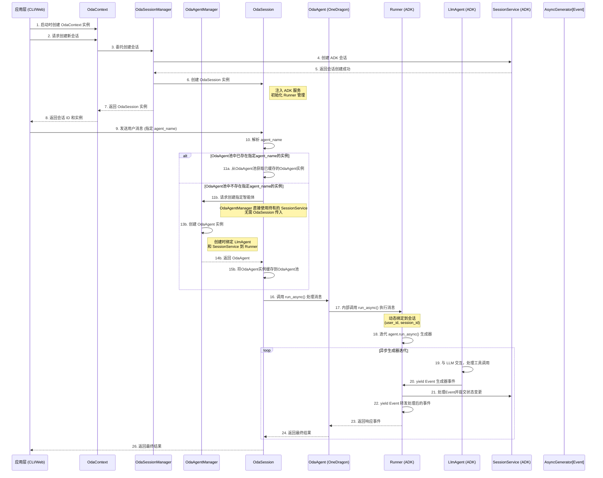
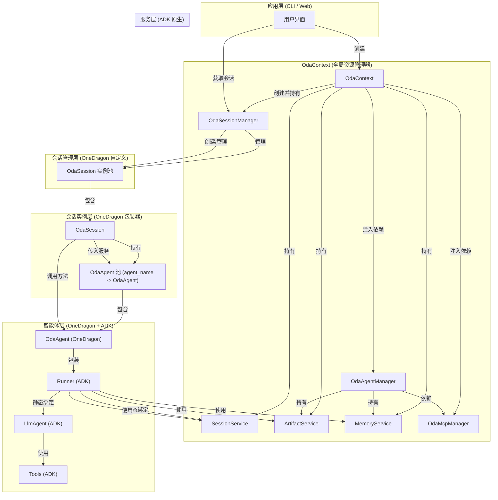
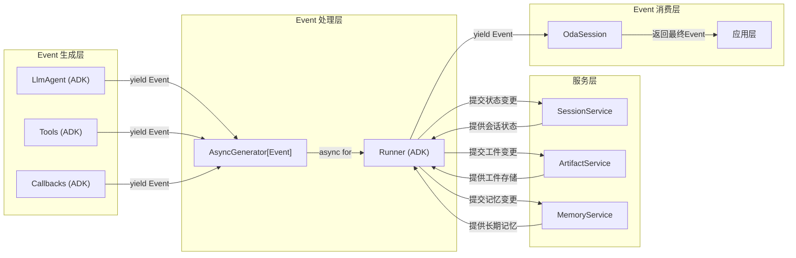

# 核心架构设计

## 1. 架构概述与设计原则

### 1.1 架构目标

OneDragon-Agent 旨在构建一个简洁、高效、原生的多会话对话系统，直接利用 Google Agent Development Kit (ADK) 作为核心基础。该架构通过必要的封装层提供业务友好的接口，专注于提供灵活的会话管理和智能体管理能力。

### 1.2 核心特点

- **ADK 原生**: 直接使用 ADK 核心组件，通过封装层提供业务接口，具体见 [adk-python](https://google.github.io/adk-docs/)
- **异步流式处理**: 完全基于 ADK 的异步生成器模式
- **多会话支持**: 天然支持多会话、多智能体场景
- **异步优先**: 所有操作都是异步的，性能优异

### 1.3 设计原则

- **简洁性**: 避免过度抽象，直接利用 ADK 原生能力
- **模块化**: 组件间职责清晰，便于维护和扩展
- **封装性**: 通过封装层隐藏 ADK 复杂性，提供简化接口
- **性能导向**: 优先考虑异步处理和资源利用效率
- **可扩展性**: 支持动态添加智能体和功能扩展

### 1.4 技术栈

```
应用层 (CLI/Web)
    ↓
OneDragon 封装层 (业务接口)
    ↓
ADK 原生组件 (核心执行引擎)
```

## 2. 核心组件

### 2.1 `OdaContext` (全局资源管理器)

#### **角色**
系统的全局服务容器和资源管理器。

#### **持有组件**

- `SessionService`: 作为会话数据的存储和管理基础设施，提供给OdaAgentManager和OdaSessionManager使用。
- `ArtifactService`: 作为工件数据的存储和管理基础设施，提供给OdaAgentManager使用。
- `MemoryService`: 作为长期记忆管理的ADK原生服务，提供给OdaAgentManager使用。

- `OdaSessionManager`: 作为会话实例的全局管理器，提供会话的 CRUD 操作接口。
- `OdaAgentManager`: 作为智能体配置的全局管理器，负责创建和管理 `OdaAgent` 实例，需要MemoryService等ADK原生服务来创建Runner实例。
- `OdaMcpManager`: 作为MCP配置和工具的全局管理器，负责MCP配置管理和MCPToolset创建，为OdaAgentManager提供MCP工具支持。

#### **提供功能**
- **系统初始化流程**: 负责系统启动时各服务组件和管理组件的初始化，包括创建MemoryService实例。
- **资源分配流程**: 负责根据系统需求分配和管理各类资源。
- **生命周期管理流程**: 负责系统整体的启动、运行和关闭的生命周期管理。
- **依赖注入流程**: 负责各组件间的依赖关系管理和注入，为OdaAgentManager和OdaSessionManager提供所需的依赖，包括将MemoryService注入到OdaAgentManager，将OdaMcpManager注入到OdaAgentManager。
- **全局配置管理**: 负理系统级别的配置信息和整体生命周期。

### 2.2 `OdaSessionManager` (会话管理层)

#### **角色**
`OdaContext` 持有的会话管理组件，负责会话实例的完整生命周期管理。

#### **持有组件**
- `SessionService`: 作为会话数据的底层存储引擎。

#### **提供功能**
- **会话实例管理**: 负责 `OdaSession` 实例的创建、查找、更新和删除。
- **生命周期控制**: 管理会话实例的生命周期，包括超时清理和资源释放。
- **会话级别接口**: 提供会话级别的查询、统计和监控接口。
- **协调操作**: 作为 `OdaContext` 和 `OdaSession` 之间的桥梁，协调会话相关操作。
- **资源管理**: 确保会话资源的合理分配和使用。

### 2.3 `OdaAgentManager` (智能体管理层)

#### **角色**
`OdaContext` 持有的智能体管理组件，负责创建和管理 `OdaAgent` 实例。

#### **持有组件**
- `OdaAgentConfig`: 作为智能体配置的标准化模板。
- `OdaToolManager`: 作为工具管理的核心组件，负责工具实例的注册和工厂方法，用于创建智能体所需的内置工具实例。
- `OdaMcpManager`: 作为MCP配置和工具的管理组件，负责MCP配置的CRUD操作和MCPToolset的创建管理，用于创建智能体所需的MCP工具集。
- `ArtifactService`: 作为工件存储管理的ADK原生服务，用于创建Runner实例时的工件处理。
- `MemoryService`: 作为长期记忆管理的ADK原生服务，用于创建Runner实例时的记忆处理。

#### **提供功能**
- **OdaAgent 实例创建**: 通过 ADK 原生 `LlmAgent` 工厂模式创建 `OdaAgent` 实例，负责智能体的正确初始化，需要SessionService、ArtifactService、MemoryService等ADK原生服务来创建Runner实例，通过OdaMcpManager获取MCPToolset实例。
- **服务依赖注入**: `OdaAgentManager` 直接持有 `SessionService`，在创建 `OdaAgent` 实例时直接使用持有的服务实例，无需 `OdaSession` 传入。
- **配置管理功能**: 提供智能体配置的动态注册、更新和注销功能，支持运行时配置变更。
- **配置协调服务**: 协调 `OdaSessionManager` 在会话创建时注入所需的智能体配置。
- **依赖关系管理**: 管理智能体间的依赖关系、工具共享和配置继承。
- **全局配置中心**: 确保智能体配置的一致性和可复用性。

### 2.4 `OdaSession` (会话实例层)

#### **角色**
代表一个独立的、隔离的用户对话会话，是 ADK 原生组件的业务包装器。

#### **持有组件**

- `OdaAgentManager`: 作为智能体管理的核心组件。
- `OdaAgent池`: 作为智能体实例的缓存池，按agent_name缓存已创建的OdaAgent实例。

#### **提供功能**
- **消息处理功能**: 提供用户消息发送、智能体选择、状态查询等核心业务功能。
- **会话业务逻辑**: 负责会话的业务逻辑处理、状态管理和生命周期控制。
- **多智能体支持**: 支持同一会话中多个智能体的无缝切换和协作。
- **状态管理**: 管理会话的业务状态和用户上下文。
- **生命周期管理**: 负责会话资源的分配、使用和清理。
- **用户接口**: 提供友好的用户接口，封装 ADK 的复杂性。
- **智能体调用**: 通过调用 `OdaAgent` 的业务方法来处理消息，不直接操作 ADK 的 `Runner`。

### 2.5 `OdaAgent` (智能体封装层)

#### **角色**
OneDragon 自定义的智能体封装类，持有 ADK 原生 `Runner` 实例，为 `OdaSession` 提供简化的业务接口，完全封装 ADK 的异步生成器模式。

#### **来源**
OneDragon 自定义包装类

#### **持有组件**
- `Runner`: 作为智能体执行的底层引擎。
- `LlmAgent`: 作为智能体逻辑的核心组件。

#### **提供功能**
- **Runner 管理**: 管理 ADK 原生 `Runner` 实例的生命周期。
- **业务接口封装**: 提供简化的业务方法（如 `run_async()` 和 `run()`），内部调用 `Runner.run_async()` 并内置错误重试机制。
- **执行逻辑处理**: 处理用户消息的完整执行流程，包括事件流处理和结果提取。
- **错误重试管理**: 在 Runner 执行异常时自动进行重试，支持可配置的重试次数和递增间隔策略，产生符合 ADK 原生标准的重试状态事件。
- **状态管理**: 管理智能体相关的状态和配置信息。
- **拓展能力预留**: 为未来实现智能体拓展能力保留接口和结构。

#### **业务方法**
- `run_async(new_message: str) -> AsyncGenerator[Event, None]`: 异步执行智能体，返回Event流生成器
- `run(new_message: str) -> Generator[Event, None, None]`: 同步执行智能体，返回Event流生成器
- `get_agent_info() -> dict`: 获取智能体信息
- `is_ready() -> bool`: 检查智能体是否就绪
- `cleanup() -> None`: 清理智能体资源

### 2.6 ADK 原生组件简介

本项目基于 Google Agent Development Kit (ADK) 构建，直接使用了 ADK 的多个原生组件。这些组件提供了构建 AI 应用的核心能力，包括智能体执行、会话管理、工件存储等。

#### `Runner` (ADK 原生智能体执行器)

**角色**: ADK 原生的智能体执行器，负责协调智能体的执行流程和异步Event流处理。

**持有组件**:
- **智能体组件**:
    - `LlmAgent`: 作为执行的具体智能体。

- **服务组件**:
    - `SessionService`: 用于会话状态管理。
    - `ArtifactService`: 用于工件管理。
    - `MemoryService`: 用于长期记忆管理。

**提供功能**:
- **智能体执行**: 执行具体的用户请求，协调 LlmAgent 的执行流程。
- **异步生成器处理**: 通过 `async for event in agent.run_async()` 迭代处理Event流。
- **Event流管理**: 管理工具调用和Event流的生成与消费。
- **会话状态管理**: 通过 `SessionService` 管理会话状态。
- **异步处理**: 提供基于Python async/await的异步处理能力。
- **执行协调**: 负责智能体执行流程的协调和管理。

#### `LlmAgent` (ADK 原生智能体)

**角色**: ADK 原生的大语言模型智能体，处理具体的用户请求。

**持有组件**:
- `Tools`: 作为智能体的工具集合。

**提供功能**:
- **LLM 交互**: 与大语言模型进行交互，生成响应。
- **工具执行**: 执行工具调用和管理子智能体。
- **事件处理**: 处理回调函数和生命周期事件。
- **配置管理**: 管理智能体的配置和行为。
- **智能体能力**: 提供强大的 LLM 交互能力。

#### `SessionService` (ADK 原生会话服务)

**角色**: ADK 原生的会话服务，负责会话数据的存储和管理。

**持有组件**:
- 内部存储会话实例、事件历史和状态数据。

**提供功能**:
- **会话 CRUD 操作**: 管理会话的创建、存储、检索和删除。
- **事件历史管理**: 处理会话状态和事件历史的管理。
- **查询和统计**: 提供会话查询和统计功能。
- **存储后端**: 作为 `Runner` 的会话存储后端。

#### `ArtifactService` (ADK 原生工件服务)

**角色**: ADK 原生的工件服务，负责工件数据的存储和管理。

**提供功能**:
- **工件 CRUD 操作**: 管理工件的创建、存储、检索和删除。
- **版本管理**: 支持工件的版本控制和管理。
- **存储后端**: 作为 `Runner` 的工件存储后端。

#### `MemoryService` (ADK 原生记忆服务)

**角色**: ADK 原生的记忆服务，负责长期记忆的存储和检索。

**提供功能**:
- **记忆存储**: 将会话内容添加到长期记忆存储中。
- **记忆检索**: 根据查询检索相关的记忆内容。
- **跨会话支持**: 支持跨会话的长期记忆管理。

ADK 原生组件在本项目中发挥着基础性作用，它们提供了：
- **智能体执行能力**: 通过 `Runner` 和 `LlmAgent` 实现智能体的核心逻辑执行
- **会话状态管理**: 通过 `SessionService` 管理会话数据和状态
- **工件存储管理**: 通过 `ArtifactService` 处理非文本数据的存储
- **长期记忆管理**: 通过 `MemoryService` 管理跨会话的长期记忆
- **异步流式处理架构**: 提供基于异步生成器的Event流处理机制

关于这些组件的详细信息，请参考 [adk-python 文档](https://github.com/google/adk-python)。

### 2.12 命名约定 (Naming Conventions)

为了确保代码的清晰性和一致性，项目遵循以下命名约定：

1.  **`Oda` 前缀的使用**:
    -   **使用场景**: `Oda` 前缀（代表 One Dragon Agent）仅用于 OneDragon 自定义的核心包装类。
    -   **示例**: `OdaContext`, `OdaSession`, `OdaSessionManager`, `AgentManager`。

2.  **省略 `Oda` 前缀**:
    -   **使用场景**: 对于 ADK 原生类和配置类，省略 `Oda` 前缀。
    -   **目的**:
        -   **清晰性**: 明确区分 ADK 原生组件和 OneDragon 自定义组件。
        -   **一致性**: 与 ADK 官方命名风格保持一致。
        -   **简洁性**: 避免冗余，使类名更简洁。
    -   **示例**: `OdaAgentConfig`, `SessionConfig`, `SessionInfo`, `Runner`, `LlmAgent`。

## 3. 核心执行流程

以下是系统处理一个用户命令的完整流程：



**流程详解**:

1.  **初始化**: 应用启动时，创建全局唯一的 `OdaContext` 实例，初始化 ADK 原生服务。
2.  **创建会话请求**: 应用向 `OdaContext` 请求创建新会话。
3.  **会话创建**: `OdaContext` 委托 `OdaSessionManager` 创建会话。
4.  **ADK 会话创建**: `OdaSessionManager` 通过 `SessionService` 创建 ADK 原生会话。
5.  **包装器创建**: `OdaSessionManager` 创建 `OdaSession` 实例，包装 ADK 会话并提供业务接口。
6.  **返回实例**: `OdaSession` 实例返回给应用层，包含会话 ID 和操作接口。
7.  **消息发送**: 应用向 `OdaSession` 发送用户消息，必须指定 `agent_name`。
8.  **智能体获取**: `OdaSession` 根据指定的 `agent_name` 从 `OdaAgent池` 获取 `OdaAgent` 实例，如果不存在则请求 `OdaAgentManager` 创建。
9.  **服务使用**: `OdaSession` 请求 `OdaAgentManager` 创建 `OdaAgent` 实例，`OdaAgentManager` 直接使用持有的 `SessionService` 进行创建。
10. **Runner创建**: `OdaAgentManager` 使用持有的 `SessionService` 创建 `OdaAgent`，静态绑定 `LlmAgent` 到 `Runner`。
11. **智能体调用**: `OdaSession` 调用 `OdaAgent.run_async()` 方法处理消息，完全封装 ADK 复杂性。
12. **内部执行**: `OdaAgent` 内部调用 `Runner.run_async()` 方法，动态绑定到具体会话。
13. **异步生成器**: Runner 迭代 `LlmAgent.run_async()` 返回的异步生成器。
14. **Event 生成**: `LlmAgent` 执行逻辑，与 LLM 交互，通过 `yield Event` 生成事件流。
15. **Event 处理**: Runner 迭代处理每个 Event，调用相应服务提交状态变更。
16. **结果提取**: `OdaAgent` 处理完整的事件流，提取最终响应结果。
17. **错误重试处理**: 在 Event 流处理层面，`OdaAgent` 自动检测异常并触发重试机制。用户消息只提交一次，重试时从当前会话状态恢复，避免重复输入。按递增间隔（1s, 2s, 4s, 8s...）进行重试，产生符合 ADK 原生标准的重试事件，通知上层应用重试状态。达到最大重试次数后产生最终错误事件。
18. **结果返回**: `OdaAgent` 将最终响应返回给 `OdaSession`，再返回给应用层。

## 4. 架构图



## 5. ADK 异步流式处理架构

ADK 采用异步流式处理架构设计，基于 Python 的异步生成器模式。Agent 通过生成器产生 Event 流，Runner 通过迭代处理这些 Event，形成完整的异步处理链路。

### 5.1 异步流式处理架构图



### 5.2 Event 类型和处理流程

ADK 中 Event 是 Agent 和 Runner 之间的通信载体，主要类型包括：

1. **用户输入Event**: `Event(author='user', content=...)`
2. **智能体响应Event**: `Event(author='AgentName', content=...)`
3. **工具调用Event**: `Event(content={function_call: ...})`
4. **工具结果Event**: `Event(content={function_response: ...})`
5. **状态变更Event**: `Event(actions={state_delta: ...})`
6. **控制流Event**: `Event(actions={transfer_to_agent: ...})`
7. **错误重试Event**: `Event(error_code="RETRY_ATTEMPT", error_message="...")`
8. **最终错误Event**: `Event(error_code="MAX_RETRIES_EXCEEDED", error_message="...", actions={escalate: true})`

**异步流式处理流程**:
1. `Runner.run_async()` 内部调用 `LlmAgent.run_async()` 并迭代其返回的事件流
2. `LlmAgent` 通过 `yield Event` 生成事件流
3. 每次迭代处理一个 Event，调用相应的服务提交状态变更
4. `Runner` 处理完后 `yield event` 给上层消费者
5. `OdaAgent` 在 Event 流处理层面检测到异常时触发错误重试机制，产生符合 ADK 原生标准的重试事件。**用户消息只提交一次，重试时从当前会话状态恢复，避免重复输入**
6. 重试事件通过标准的 `error_code` 和 `error_message` 传递错误信息，符合 ADK 原生事件标准
7. 达到最大重试次数后，产生包含 `escalate: true` 的最终错误事件
8. 最终 Event 流返回给应用层

### 5.3 异步生成器模式优势

- **异步处理**: 基于 Python async/await，提高系统性能和并发能力
- **事件驱动**: Event 作为异步通信载体，支持复杂的执行流程控制
- **流式处理**: Event 流被顺序迭代处理，支持实时响应和状态更新
- **内存高效**: 生成器模式按需产生 Event，避免一次性加载所有事件到内存
- **状态管理**: Event 处理后状态自动提交到相应服务，保证数据一致性
- **错误隔离**: Event 流处理层面的错误不会影响整体系统的稳定性

## 6. 会话标识与智能体管理

### 6.1 会话标识三元组

ADK 使用**三元组**唯一标识每个会话：
- `app_name` - 应用名称（如：客服应用、数据分析应用）
- `user_id` - 用户标识（如：user_123）
- `session_id` - 会话标识（如：session_abc）

### 6.2 每个会话独立智能体

**智能体使用策略**：
- **会话隔离**：每个会话创建自己独立的 OdaAgent 实例
- **独立实例**：相同 `agent_name` 在不同会话中创建完全独立的智能体实例
- **状态隔离**：每个会话的智能体只访问本会话的对话历史，跨会话完全隔离