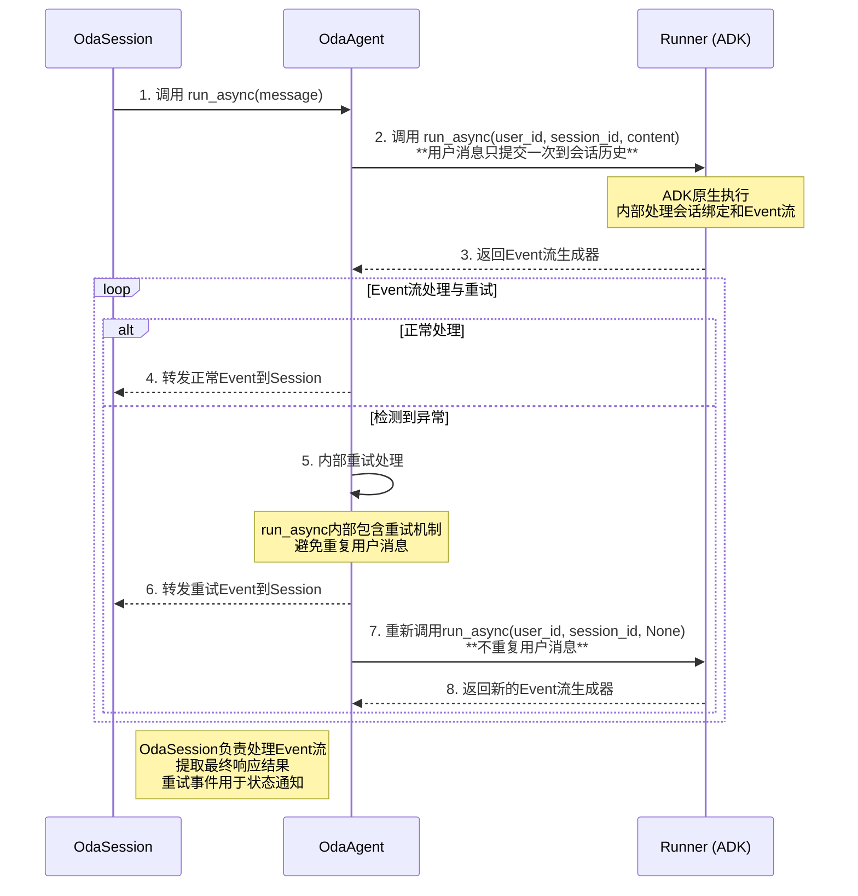
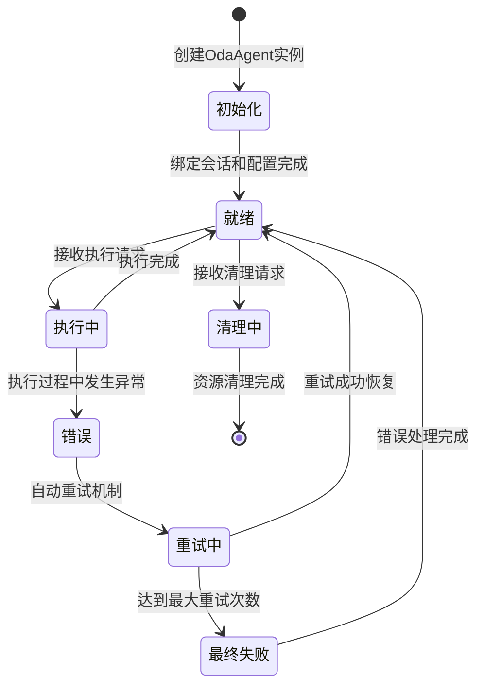

# OdaAgent 模块设计文档

## 1. 概述

`OdaAgent` 是 OneDragon-Agent 的智能体封装层，由 `OdaAgentManager` 创建，作为 ADK 原生 `Runner` 实例的轻量级包装器。每个 `OdaAgent` 实例代表一个独立的智能体执行器，为 `OdaSession` 提供 ADK 原生的执行接口，保持与 ADK Runner 一致的接口设计。

`OdaAgent` 采用会话隔离的设计模式，每个实例只服务于一个特定的会话，确保智能体执行的安全性和数据隔离。它不提供额外的业务逻辑封装，而是专注于 ADK 原生能力的直接暴露和会话绑定管理。

## 2. 架构总览

`OdaAgent` 作为 `OdaSession` 与 ADK 原生层之间的适配器，专注于会话隔离和接口适配。它直接暴露 ADK 原生接口，不进行额外的业务逻辑封装，确保接口的一致性和可预测性。

`OdaAgent` 采用适配器模式设计，内部持有 ADK 原生 `Runner` 实例，对外提供与 ADK Runner 完全一致的接口，实现会话绑定与 ADK 执行的解耦。`OdaSession` 作为真正的业务入口，负责将业务请求转换为 ADK 原生调用。

## 3. 核心概念

*   **`OdaAgent`**: OneDragon自定义的智能体适配器类，持有 ADK 原生 `Runner` 实例，提供与 Runner 一致的接口。
*   **`Runner` (ADK原生)**: 智能体执行器，负责协调 LlmAgent 的执行流程和异步Event流处理。
*   **`LlmAgent` (ADK原生)**: 大语言模型智能体，处理具体的用户请求和大语言模型交互，已包含所需的工具集合。
*   **会话绑定**: 将智能体实例动态绑定到具体的会话标识 (`app_name`, `user_id`, `session_id`)。
*   **异步处理模式**: 基于 Python async/await 的异步事件处理机制。
*   **事件流处理**: 处理 ADK 原生 Event 流的完整机制，包括工具调用和状态管理。
*   **接口适配**: OdaAgent 提供简化的接口，内部持有会话标识，外部调用时无需重复传递会话参数。

## 4. ADK 原生组件能力范围分析

### 4.1 Runner 提供的核心能力

#### **智能体执行能力**
- ✅ **异步执行**: 通过 `run_async()` 方法提供异步智能体执行能力
- ✅ **事件流处理**: 处理 ADK 原生 Event 流的完整机制，包括工具调用和状态管理
- ✅ **会话绑定**: 支持动态绑定到具体的会话标识
- ✅ **状态管理**: 自动管理智能体执行过程中的状态变更

#### **服务集成能力**
- ✅ **SessionService 集成**: 自动使用 SessionService 进行会话状态管理
- ✅ **ArtifactService 集成**: 自动使用 ArtifactService 进行工件数据管理
- ✅ **MemoryService 集成**: 自动使用 MemoryService 进行长期记忆管理
- ✅ **服务协调**: 协调多个服务之间的数据流转和状态同步

#### **工具调用能力**
- ✅ **工具执行**: 支持智能体调用工具并处理工具执行结果
- ✅ **事件传播**: 工具调用结果通过 Event 流传播给上层消费者
- ✅ **状态跟踪**: 跟踪工具调用的完整生命周期
- ✅ **错误处理**: 处理工具执行过程中的异常和错误

### 4.2 LlmAgent 提供的核心能力

#### **LLM 交互能力**
- ✅ **消息处理**: 处理用户输入消息并生成响应
- ✅ **对话历史管理**: 维护智能体的对话历史和上下文
- ✅ **模型调用**: 与大语言模型进行交互，生成智能响应
- ✅ **流式输出**: 支持流式文本输出，提供实时响应体验

#### **智能体行为控制**
- ✅ **配置管理**: 支持智能体配置的动态设置和更新
- ✅ **工具集成**: 智能体可以使用各种工具来扩展能力
- ✅ **决策逻辑**: 基于输入和上下文做出智能决策
- ✅ **多轮对话**: 支持复杂的多轮对话场景

### 4.3 OdaAgent 需要额外实现的功能

#### **错误重试机制**
- ✅ **自动重试**: 在 Runner 执行异常时自动进行重试，重试次数可配置
- ✅ **递增间隔**: 重试间隔时间逐渐递增，避免立即重试造成的服务压力
- ✅ **重试事件**: 重试过程中产生符合 ADK 原生标准的事件，通知上层应用重试状态
- ✅ **最终失败**: 达到最大重试次数后，产生最终错误事件

#### **业务接口封装**
- ✅ **简化接口**: 提供简化的业务方法，隐藏 ADK 的复杂性
- ✅ **参数转换**: 将业务参数转换为 ADK 原生参数格式
- ✅ **异常处理**: 提供业务友好的异常处理机制


## 5. 职责与功能

### 5.1 核心职责

`OdaAgent` 承担以下核心职责：

*   **Runner 管理**: 管理 ADK 原生 `Runner` 实例的生命周期，确保正确的初始化和清理。
*   **接口适配**: 提供简化的接口（`run_async()` 和 `run()`），内部持有会话标识，外部调用时只需传入消息参数，内部实现错误重试机制后委托给内部 Runner 实例。
*   **错误重试管理**: 在 Runner 执行异常时自动进行重试，支持可配置的重试次数和递增间隔策略，产生重试状态事件。
*   **会话绑定管理**: 管理智能体实例与会话标识的绑定关系，确保每次执行都正确绑定到指定会话。
*   **状态管理**: 管理智能体相关的状态和配置信息，包括会话绑定状态和重试状态。
*   **会话隔离**: 确保每个 `OdaAgent` 实例只服务于一个特定会话，实现会话间的完全隔离。
*   **资源生命周期**: 负责智能体实例的创建、运行和销毁的完整生命周期管理。

### 5.2 持有组件

`OdaAgent` 依赖并持有以下核心组件：

*   **`Runner` (ADK原生)**: 作为智能体执行的底层引擎，负责协调 LlmAgent 的执行流程和异步Event流处理。
*   **`LlmAgent` (ADK原生)**: 作为智能体逻辑的核心组件，处理具体的用户请求和大语言模型交互，已配置所需的工具集合（包括 MCP 工具）。
*   **会话标识**: 持有会话的三元组标识 (`app_name`, `user_id`, `session_id`)，确保会话隔离。
*   **重试配置**: 持有重试相关配置，包括最大重试次数、重试间隔等参数。
*   **重试状态管理**: 管理当前重试状态，包括重试次数、下次重试时间等。

### 5.3 核心功能

#### **接口委托功能**:
- 提供 `run_async(new_message: str)` 方法，内部实现完整的执行和重试逻辑，外部调用时只需传入消息参数
- 提供 `run(new_message: str)` 方法，内部实现完整的执行和重试逻辑，外部调用时只需传入消息参数

#### **执行和重试管理功能**:
- **完整执行处理**：负责消息的完整执行生命周期，从初始执行到最终响应
- **自动错误重试机制**：在 Event 流处理层面检测异常并自动触发重试
- **智能重试策略**：支持可配置的最大重试次数（默认 3 次）和递增重试间隔（1s, 2s, 4s, 8s...）
- **标准事件通知**：产生符合 ADK 原生标准的事件通知重试状态和错误状态
- **数据一致性保证**：用户消息只提交一次到会话历史，重试时从当前会话状态恢复，避免重复输入
- **重试状态管理**：提供重试取消和重置状态功能


#### **生命周期管理功能**:
- 管理 Runner 实例的创建和初始化
- 确保组件的正确启动和关闭顺序
- 处理异常情况下的状态恢复

## 6. 核心接口定义

`OdaAgent` 提供与 ADK Runner 完全一致的接口，并内置错误重试机制：

```python
from google.genai.types import Content, Part

class OdaAgent:
    def __init__(self, runner: Runner, app_name: str, user_id: str, session_id: str, max_retries: int = 3):
        """初始化OdaAgent，传入Runner实例和会话标识
        
        Args:
            runner: ADK Runner 实例
            app_name: 应用名称
            user_id: 用户标识
            session_id: 会话标识
            max_retries: 最大重试次数，默认为3次
        """
    
    async def run_async(self, new_message: str):
        """异步执行智能体，返回Event流生成器，内部实现错误重试机制
        
        内部实现错误重试机制：
        - 首次执行时使用原始用户消息，确保消息只提交一次到会话历史
        - 检测到执行异常时，按递增间隔自动重试（1s, 2s, 4s, 8s...）
        - 重试时不重复用户消息，从当前会话状态恢复
        - 产生符合 ADK 原生标准的事件通知重试状态
        - 达到最大重试次数后产生最终错误事件
        
        Args:
            new_message: 用户消息内容（字符串格式）
            
        Returns:
            AsyncGenerator: Event流生成器
        """
    
    def run(self, new_message: str):
        """同步执行智能体，返回Event流生成器，内部实现错误重试机制
        
        内部实现与 run_async 相同的错误重试机制
        
        Args:
            new_message: 用户消息内容（字符串格式）
            
        Returns:
            Generator: Event流生成器
        """
    
    def get_agent_info(self) -> dict:
        """获取智能体信息
        
        Returns:
            dict: 智能体信息
        """
    
    def is_ready(self) -> bool:
        """检查智能体是否就绪
        
        Returns:
            bool: 智能体是否就绪
        """
    
    async def cleanup(self) -> None:
        """清理智能体资源"""
        
    ```

### 6.1 重试事件结构

OdaAgent 在重试过程中产生符合 ADK 原生标准的简化事件结构：

```python
# 重试事件示例
{
    "author": "system",
    "content": {
        "parts": [
            {
                "text": "Retry attempt 1/3 for agent execution"
            }
        ]
    },
    "error_code": "RETRY_ATTEMPT",
    "error_message": "Retry attempt 1/3 for agent execution",
    "actions": {},
    "id": "event-retry-123",
    "timestamp": 1640995200.0
}

# 最终错误事件示例
{
    "author": "system",
    "content": null,
    "error_code": "MAX_RETRIES_EXCEEDED",
    "error_message": "Agent execution failed after 3 retry attempts",
    "actions": {
        "escalate": true
    },
    "id": "event-final-456",
    "timestamp": 1640995206.0
}
```

**设计原则**：
- **ADK 原生兼容**：重试事件使用 ADK 原生 `EventActions` 类型，确保完全兼容性
- **标准结构**：使用 `EventActions()` 构造空 actions 对象，使用 `EventActions(escalate=True)` 构造带升级标识的对象
- **简化字段**：只包含必要的 `error_code` 和 `error_message` 字段，避免复杂的自定义状态信息
- **标准错误处理**：通过标准的 `error_code` 和 `error_message` 传递错误信息，符合 ADK 原生错误处理模式
- **escalate 标识**：最终错误事件使用 `actions.escalate = true` 标识错误需要升级处理

## 7. 核心处理流程

### 7.1 接口委托流程



### 7.2 智能体状态管理流程



## 8. 资源隔离与安全

### 8.1 会话隔离机制

`OdaAgent` 实现严格的会话隔离策略：

*   **实例隔离**: 每个 `OdaAgent` 实例只服务于一个会话，避免实例复用导致的状态污染。
*   **数据隔离**: 通过会话标识确保数据访问的隔离性，防止跨会话数据泄露。
*   **状态隔离**: 智能体的运行状态完全独立，不会相互影响。
*   **资源隔离**: 智能体使用的资源按会话隔离，确保资源使用的安全性。
*   **异常隔离**: 智能体执行过程中的异常不会影响其他会话。