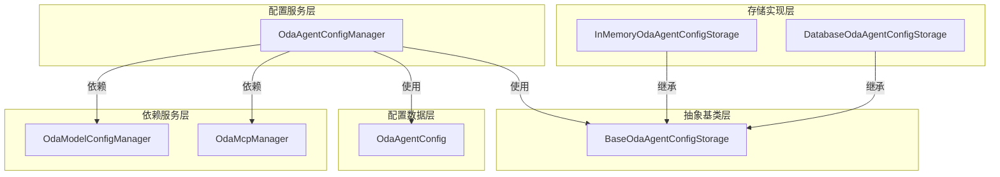

# OdaAgentConfigManager 模块设计文档

## 1. 概述

`OdaAgentConfigManager` 是 OneDragon-Agent 的智能体配置管理器，负责 `OdaAgentConfig` 配置的创建、存储、检索和管理。该管理器遵循 ADK SessionService 的设计模式，支持内存和数据库两种持久化方式，为系统提供灵活的配置管理能力。

系统内置了一个名为 "default" 的默认智能体配置，该配置自动加载且不可修改，为系统提供开箱即用的基础智能体功能。

## 2. 架构总览

`OdaAgentConfigManager` 采用抽象基类模式设计，通过继承 `BaseOdaAgentConfigStorage` 实现不同的持久化策略。该设计与 ADK 的 `BaseSessionService` 架构保持一致，通过抽象接口统一不同的存储实现。



## 3. 核心概念

*   **`OdaAgentConfigManager`**: 智能体配置管理器，负责配置的 CRUD 操作和持久化管理
*   **`BaseOdaAgentConfigStorage`**: OdaAgent配置存储抽象基类，定义了统一的配置管理接口
*   **`InMemoryOdaAgentConfigStorage`**: OdaAgent内存配置存储实现，适合开发和测试场景
*   **`DatabaseOdaAgentConfigStorage`**: OdaAgent数据库配置存储实现，提供持久化存储
*   **`OdaAgentConfig`**: 智能体配置数据类，包含智能体的所有配置信息
*   **`OdaModelConfigManager`**: 大模型配置管理器，用于验证智能体配置中的 model_config 字段
*   **`OdaMcpManager`**: MCP 配置和工具管理器，负责 MCP 配置管理和 MCPToolset 创建
*   **服务模式**: 采用服务注入模式，支持运行时切换不同的配置服务实现
*   **依赖验证**: 通过依赖注入 OdaModelConfigManager 和 OdaMcpManager 实现配置的有效性验证

## 4. 职责与功能

### 4.1 核心职责

`OdaAgentConfigManager` 承担以下核心职责：

*   **配置管理**: 负责 `OdaAgentConfig` 的创建、读取、更新和删除操作
*   **服务管理**: 提供统一的配置服务接口，支持不同的存储实现
*   **配置验证**: 验证配置数据的完整性和有效性
*   **模型验证**: 通过注入的 `OdaModelConfigManager` 验证 `model_config` 字段的有效性
*   **MCP 配置验证**: 通过注入的 `OdaMcpManager` 验证 `mcp_list` 字段中 MCP 配置的有效性
*   **内置配置管理**: 提供系统内置的默认智能体配置，支持自动加载和完全保护
*   **服务注入**: 支持通过依赖注入的方式使用不同的配置服务
*   **并发安全**: 确保多线程环境下的配置访问安全性

### 4.2 核心功能

#### **配置管理功能**:
- **创建配置**: 支持通过配置对象创建新的智能体配置
- **读取配置**: 支持通过 agent_name 查询特定配置
- **更新配置**: 支持更新现有配置的各个字段
- **删除配置**: 支持删除指定配置
- **列表查询**: 支持获取所有配置的列表

#### **内置配置管理功能**:
- **自动加载**: 系统首次请求 "default" 配置时，自动创建并加载内置默认配置
- **懒加载机制**: 默认配置只在首次访问时创建，避免不必要的资源占用
- **单例模式**: 同一 Manager 实例中，多次请求默认配置返回同一实例
- **完全保护**: 内置配置无法被创建、更新、删除或意外修改
- **非持久化**: 内置配置仅存在于内存中，不会存储到底层存储服务
- **配置隔离**: 内置配置与持久化配置完全分离，互不干扰

#### **服务实现功能**:
- **InMemoryConfigService**: 内存存储实现，数据在进程重启后丢失，适合开发和测试
- **DatabaseConfigService**: 数据库存储实现，支持持久化存储，适合生产环境
- **服务切换**: 支持运行时切换不同的配置服务实现
- **扩展性**: 支持添加新的存储实现（如文件存储、云存储等）

#### **服务特性**:
- **统一接口**: 所有存储实现都继承自 `BaseConfigService`，提供统一的 API
- **异步操作**: 所有操作都是异步的，符合 ADK 的异步优先原则
- **错误处理**: 统一的异常处理机制，便于错误追踪和处理
- **模型验证集成**: 集成 `OdaModelConfigManager` 进行模型配置验证，确保 `model_config` 字段引用的模型 ID 存在且有效
- **MCP 验证集成**: 集成 `OdaMcpManager` 进行 MCP 配置验证，确保 `mcp_list` 字段引用的 MCP 配置存在且启用

## 5. OdaAgentConfig 配置项详解

### 5.1 配置项

`OdaAgentConfig` 是智能体配置的数据类，包含以下可配置项：

| 配置项 | 类型 | 必填 | 说明 | 示例 |
|--------|------|------|------|------|
| `app_name` | `str` | 是 | 用于标识所属的应用程序 同 adk-python 的定义 | `"weather_app"` |
| `agent_name` | `str` | 是 | 智能体名称，同时作为唯一标识 | `"weather_agent"` |
| `agent_type` | `str` | 是 | ADK 中的智能体类型 | `"llm_agent"` |
| `description` | `str` | 是 | 智能体功能描述 | `"天气查询智能体"` |
| `instruction` | `str` | 是 | 智能体的系统提示词 | `"你是一个天气查询助手，帮助用户获取天气信息"` |
| `model_config` | `str` | 是 | 使用的大模型 ID | `"gemini-2.0-flash"` |
| `tool_list` | `list[str]` | 否 | 可使用工具的 ID 列表 | `["get_weather", "get_temperature"]` |
| `mcp_list` | `list[str]` | 否 | 可使用 MCP 的 ID 列表 | `["filesystem_mcp", "notion_mcp"]` |
| `sub_agent_list` | `list[str]` | 否 | 可使用子智能体的名称/ID 列表 | `["payment_agent"]` |

### 5.2 默认智能体配置

系统提供了内置的默认智能体配置功能，通过 `create_default_agent_config` 工厂函数创建：

```python
def create_default_agent_config(app_name: str) -> OdaAgentConfig:
    """创建默认智能体配置
    
    创建一个使用默认LLM配置的智能体配置实例。
    
    Args:
        app_name: 应用名称，用于标识所属的应用程序
        
    Returns:
        默认智能体配置对象
    """
```

#### 默认智能体特性：

- **固定标识**：使用 `"default"` 作为 agent_name
- **默认模型**：自动使用默认LLM配置 `"__default_llm_config"`
- **开箱即用**：提供基础的通用智能体功能，无需额外配置
- **零依赖**：默认情况下不依赖任何工具、MCP或子智能体
- **适用场景**：作为会话的默认智能体，提供通用AI助手服务

#### 与默认LLM配置的集成：

默认智能体配置与系统的默认LLM配置紧密集成：
- 自动引用 `"__default_llm_config"` 作为模型配置
- 依赖 `OdaModelConfigManager` 提供的默认配置功能
- 当环境变量设置了默认LLM参数时，默认智能体立即可用
- 无需手动配置模型参数，简化系统部署和初始化

### 5.3 配置约束

- **唯一性约束**: `agent_name` 在同一 `app_name` 下必须唯一
- **引用完整性**: `tool_list`、`mcp_list` 和 `sub_agent_list` 中引用的工具、MCP 配置和子智能体必须存在
- **模型兼容性**: `model_config` 必须是系统中可用的模型 ID，通过 `OdaModelConfigManager` 验证
- **MCP 配置有效性**: `mcp_list` 中引用的 MCP 配置必须存在且启用，通过 `OdaMcpManager` 验证
- **应用隔离**: 不同 `app_name` 下的配置相互独立，可以存在相同的 `agent_name`
- **模型验证**: 在创建和更新配置时，系统会通过依赖注入的 `OdaModelConfigManager` 验证 `model_config` 字段引用的模型 ID 是否存在且属于同一应用

## 6. 核心接口定义

### 6.1 BaseOdaAgentConfigStorage 抽象基类

```python
from abc import ABC, abstractmethod
from typing import List, Optional
from one_dragon_agent.core.agent.config.oda_agent_config import OdaAgentConfig


class BaseOdaAgentConfigStorage(ABC):
    """OdaAgent配置存储抽象基类，定义了统一的配置管理接口"""
    
    @abstractmethod
    async def create_config(self, config: OdaAgentConfig) -> None:
        """创建配置
        
        Args:
            config: 要创建的配置对象
        """
        pass
    
    @abstractmethod
    async def get_config(self, agent_name: str) -> Optional[OdaAgentConfig]:
        """获取配置
        
        Args:
            agent_name: 智能体名称，唯一标识符
            
        Returns:
            配置对象，如果不存在则返回 None
        """
        pass
    
    @abstractmethod
    async def update_config(self, config: OdaAgentConfig) -> None:
        """更新配置
        
        Args:
            config: 要更新的配置对象
        """
        pass
    
    @abstractmethod
    async def delete_config(self, agent_name: str) -> None:
        """删除配置
        
        Args:
            agent_name: 要删除的智能体名称
        """
        pass
    
    @abstractmethod
    async def list_configs(self) -> List[OdaAgentConfig]:
        """列出所有配置
        
        Returns:
            所有配置对象的列表
        """
        pass
    
    @abstractmethod
    async def validate_model_config(self, app_name: str, model_config: str) -> bool:
        """验证模型配置是否有效
        
        Args:
            app_name: 应用名称
            model_config: 模型配置ID
            
        Returns:
            如果模型配置有效返回True，否则返回False
        """
        pass
```

### 6.2 InMemoryOdaAgentConfigStorage 内存配置存储

```python
from typing import List, Optional
from one_dragon_agent.core.agent.config.oda_agent_config import OdaAgentConfig


class InMemoryOdaAgentConfigStorage(BaseOdaAgentConfigStorage):
    """OdaAgent内存配置存储实现，适合开发和测试场景"""
    
    def __init__(self, model_config_manager):
        """初始化内存配置服务
        
        Args:
            model_config_manager: 模型配置管理器，用于验证模型配置
        """
        self._configs: dict[str, OdaAgentConfig] = {}
        self.model_config_manager = model_config_manager
    
    async def create_config(self, config: OdaAgentConfig) -> None:
        """创建配置
        
        Args:
            config: 要创建的配置对象
            
        Raises:
            ValueError: 如果配置已存在
        """
        pass
    
    async def get_config(self, agent_name: str) -> Optional[OdaAgentConfig]:
        """获取配置
        
        Args:
            agent_name: 智能体名称，唯一标识符
            
        Returns:
            配置对象，如果不存在则返回 None
        """
        pass
    
    async def update_config(self, config: OdaAgentConfig) -> None:
        """更新配置
        
        Args:
            config: 要更新的配置对象
            
        Raises:
            ValueError: 如果配置不存在
        """
        pass
    
    async def delete_config(self, agent_name: str) -> None:
        """删除配置
        
        Args:
            agent_name: 要删除的智能体名称
        """
        pass
    
    async def list_configs(self) -> List[OdaAgentConfig]:
        """列出所有配置
        
        Returns:
            所有配置对象的列表
        """
        pass
    
    async def validate_model_config(self, app_name: str, model_config: str) -> bool:
        """验证模型配置是否有效
        
        Args:
            app_name: 应用名称
            model_config: 模型配置ID
            
        Returns:
            如果模型配置有效返回True，否则返回False
        """
        pass
```

### 6.3 DatabaseOdaAgentConfigStorage 数据库配置存储

```python
from typing import List, Optional
from one_dragon_agent.core.agent.config.oda_agent_config import OdaAgentConfig


class DatabaseOdaAgentConfigStorage(BaseOdaAgentConfigStorage):
    """OdaAgent数据库配置服务实现，提供持久化存储"""
    
    def __init__(self, db_url: str, model_config_manager):
        """初始化数据库配置服务
        
        Args:
            db_url: 数据库连接 URL
            model_config_manager: 模型配置管理器，用于验证模型配置
        """
        self.db_url = db_url
        self.model_config_manager = model_config_manager
    
    async def create_config(self, config: OdaAgentConfig) -> None:
        """创建配置
        
        Args:
            config: 要创建的配置对象
        """
        pass
    
    async def get_config(self, agent_name: str) -> Optional[OdaAgentConfig]:
        """获取配置
        
        Args:
            agent_name: 智能体名称，唯一标识符
            
        Returns:
            配置对象，如果不存在则返回 None
        """
        pass
    
    async def update_config(self, config: OdaAgentConfig) -> None:
        """更新配置
        
        Args:
            config: 要更新的配置对象
        """
        pass
    
    async def delete_config(self, agent_name: str) -> None:
        """删除配置
        
        Args:
            agent_name: 要删除的智能体名称
        """
        pass
    
    async def list_configs(self) -> List[OdaAgentConfig]:
        """列出所有配置
        
        Returns:
            所有配置对象的列表
        """
        pass
    
    async def validate_model_config(self, app_name: str, model_config: str) -> bool:
        """验证模型配置是否有效
        
        Args:
            app_name: 应用名称
            model_config: 模型配置ID
            
        Returns:
            如果模型配置有效返回True，否则返回False
        """
        pass
```

### 6.4 OdaAgentConfigManager 配置管理器

```python
class OdaAgentConfigManager:
    """智能体配置管理器，提供服务注入和统一的配置管理接口"""
    
    def __init__(self, config_service: BaseOdaAgentConfigStorage, model_config_manager, mcp_manager):
        """初始化配置管理器
        
        Args:
            config_service: 配置服务实例，可以是任何继承自 BaseOdaAgentConfigStorage 的实现
            model_config_manager: 模型配置管理器，用于验证模型配置
            mcp_manager: MCP管理器，用于验证MCP配置
        """
        self.config_service = config_service
        self.model_config_manager = model_config_manager
        self.mcp_manager = mcp_manager
    
    async def create_config(self, config: OdaAgentConfig) -> None:
        """创建智能体配置
        
        创建持久化的智能体配置，配置将被存储到底层服务中。
        在创建之前会验证所有引用的模型和MCP配置是否有效。
        
        Args:
            config: 要创建的配置对象
            
        Raises:
            ValueError: 当配置无效或引用了不存在的配置时抛出异常
        """
        pass
    
    async def get_config(self, agent_name: str) -> Optional[OdaAgentConfig]:
        """获取智能体配置
        
        Args:
            agent_name: 智能体名称，唯一标识符
            
        Returns:
            配置对象，如果不存在则返回 None
        """
        pass
    
    async def update_config(self, config: OdaAgentConfig) -> None:
        """更新智能体配置
        
        更新持久化的智能体配置。在更新之前会验证所有引用的模型和MCP配置是否有效。
        
        Args:
            config: 要更新的配置对象
            
        Raises:
            ValueError: 当配置无效或引用了不存在的配置时抛出异常
        """
        pass
    
    async def delete_config(self, agent_name: str) -> None:
        """删除智能体配置
        
        Args:
            agent_name: 要删除的智能体名称
        """
        pass
    
    async def list_configs(self) -> List[OdaAgentConfig]:
        """获取所有智能体配置
        
        Returns:
            所有配置对象的列表
        """
        pass
    
    async def validate_model_config(self, app_name: str, model_config: str) -> bool:
        """验证模型配置是否有效
        
        Args:
            app_name: 应用名称
            model_config: 模型配置ID
            
        Returns:
            如果模型配置有效返回True，否则返回False
        """
        pass
    
    async def validate_mcp_config(self, app_name: str, mcp_list: list[str]) -> bool:
        """验证 MCP 配置是否有效
        
        Args:
            app_name: 应用名称
            mcp_list: MCP配置ID列表
            
        Returns:
            如果所有MCP配置都有效返回True，否则返回False
        """
        pass
    
    def is_built_in_config(self, agent_name: str) -> bool:
        """检查是否为内置配置
        
        Args:
            agent_name: 智能体名称
            
        Returns:
            如果为内置配置返回True，否则返回False
        """
        pass
```
