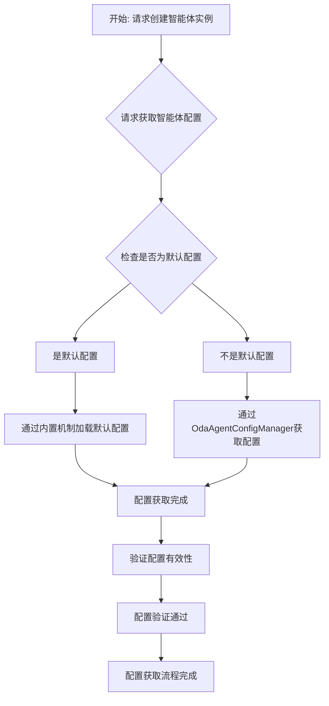
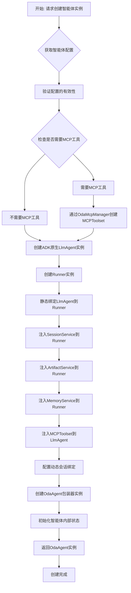
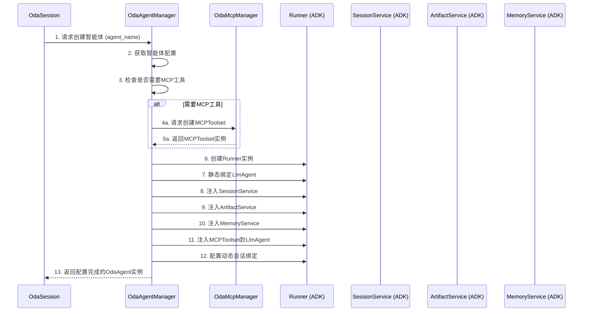

# OdaAgentManager 模块设计文档

## 1. 概述

`OdaAgentManager` 是 OneDragon-Agent 的智能体管理层，由 `OdaContext` 持有，负责系统中所有智能体实例的完整生命周期管理。作为智能体管理的核心组件，它为上层应用提供标准化的智能体操作接口，确保智能体资源的合理分配和高效使用。

`OdaAgentManager` 通过 `ArtifactService`、`MemoryService`、`OdaToolManager` 和 `OdaMcpManager` 提供的 ADK 原生能力，实现了智能体配置的标准化管理和智能体实例的动态创建，支持多智能体场景下的配置复用和实例隔离。`OdaAgentManager` 持有 `OdaMcpManager` 用于创建智能体所需的 MCP 工具集。

## 2. 架构总览

`OdaAgentManager` 作为 `OdaContext` 的核心管理组件之一，专注于智能体层面的业务逻辑。它不直接处理具体的消息执行，而是通过 `OdaAgent` 实例为上层应用提供智能体级别的操作接口。

`OdaAgentManager` 采用配置驱动的设计模式，每个智能体都基于标准化的配置模板创建，确保智能体行为的一致性和可预测性。`OdaAgentManager` 持有 `OdaToolManager` 用于创建智能体中的 `Runner` 实例所需的工具。

## 3. 核心概念

*   **`OdaAgentManager`**: 智能体管理层组件，负责智能体实例的完整生命周期管理。
*   **`OdaAgentConfig`**: 智能体配置模板，定义智能体的标准配置参数。
*   **`OdaAgentConfigManager`**: 智能体配置管理器，负责智能体配置的获取和管理，支持内置默认配置。
*   **`OdaToolManager`**: 由 `OdaContext` 持有的工具管理器，负责工具实例的注册和工厂方法。
*   **`OdaMcpManager`**: 由 `OdaContext` 持有的 MCP 配置和工具管理器，负责 MCP 配置的 CRUD 操作和 MCPToolset 的创建管理。
*   **`ArtifactService` (ADK原生)**: 由 `OdaContext` 提供的工件服务，提供工件数据的存储和管理能力。
*   **`MemoryService` (ADK原生)**: 由 `OdaContext` 提供的记忆服务，提供长期记忆的存储和检索能力。
*   **`OdaAgent`**: OneDragon自定义的智能体封装类，持有ADK原生的 `Runner` 实例。
*   **智能体配置池**: 当前活跃的智能体配置集合，用于配置的快速访问和管理。
*   **智能体实例管理**: 智能体实例的创建、缓存和生命周期控制。

## 4. 职责与功能

### 4.1 核心职责

`OdaAgentManager` 承担以下核心职责：

*   **智能体实例创建**: 通过 ADK 原生 `LlmAgent` 工厂模式创建 `OdaAgent` 实例，负责智能体的正确初始化，需要 `SessionService`、`ArtifactService`、`MemoryService`、`OdaToolManager` 和 `OdaMcpManager` 等服务来创建 `Runner` 实例。
*   **会话绑定管理**: 创建后立即将 `OdaAgent` 实例绑定到具体的 `OdaSession`，每个 `OdaAgent` 只为一个会话服务，确保会话间的完全隔离。
*   **服务依赖注入**: `OdaAgentManager` 在初始化时持有 `SessionService` 和 `OdaToolManager`，在创建 `OdaAgent` 实例时直接使用持有的服务实例，无需 `OdaSession` 传入。
*   **工具实例创建**: 通过 `OdaToolManager` 创建智能体所需的工具实例，并将其注入到 `Runner` 实例中。
*   **配置管理功能**: 通过 `OdaAgentConfigManager` 获取智能体配置，支持内置默认配置。
*   **配置协调服务**: 协调 `OdaSessionManager` 在会话创建时注入所需的智能体配置。
*   **依赖关系管理**: 管理智能体间的依赖关系、工具共享和配置继承。
*   **全局配置中心**: 确保智能体配置的一致性和可复用性。
*   **智能体信息查询**: 提供智能体配置信息和状态查询功能。

### 4.2 持有组件

`OdaAgentManager` 依赖并持有以下核心组件：

*   **`OdaAgentConfig`**: 作为智能体配置的标准化模板，定义智能体的基本参数和行为。
*   **`OdaAgentConfigManager`**: 作为智能体配置管理器，负责智能体配置的获取和管理，支持内置默认配置。
*   **`OdaToolManager`**: 作为工具管理的核心组件，负责工具实例的注册和工厂方法，用于创建智能体所需的工具实例。
*   **`SessionService`**: 作为会话数据管理的 ADK 原生服务，用于创建 `Runner` 实例时的会话处理。
*   **`ArtifactService`**: 作为工件存储管理的 ADK 原生服务，用于创建 `Runner` 实例时的工件处理。
*   **`MemoryService`**: 作为长期记忆管理的 ADK 原生服务，用于创建 `Runner` 实例时的记忆处理。

### 4.3 核心功能

#### **智能体配置管理功能**:
- 管理标准化的智能体配置模板
- 支持配置的动态注册、更新和注销
- 提供配置版本管理和历史记录
- 确保配置参数的正确性和一致性

#### **智能体实例创建功能**:
- 通过 ADK 原生工厂创建 `OdaAgent` 实例
- 将 `LlmAgent` 静态绑定到 `Runner`
- 注入 `SessionService`、`ArtifactService` 和 `MemoryService` 到 `Runner`
- 配置动态会话绑定，确保会话隔离
- 确保 `OdaAgent` 实例的正确初始化

#### **工具实例创建功能**:
- 通过 `OdaToolManager` 创建智能体所需的内置工具实例
- 将工具实例注入到 `Runner` 实例中
- 管理工具实例的生命周期
- 确保工具实例的正确初始化

#### **MCP 工具集成功能**:
- **MCPToolset 创建**: 通过 `OdaMcpManager` 创建智能体所需的 MCP 工具集
- **MCP 配置管理**: 验证和管理智能体的 MCP 配置信息
- **工具集成**: 将 MCPToolset 作为工具集合注入到 `LlmAgent` 实例中
- **生命周期管理**: 管理 MCP 工具的创建、使用和清理
- **会话隔离**: 确保不同会话的 MCP 工具实例相互隔离

#### **服务依赖注入功能**:
- 在初始化时持有所有必要的 ADK 服务实例
- 将 `SessionService`、`ArtifactService`、`MemoryService`、`OdaToolManager` 和 `OdaMcpManager` 注入到 `Runner` 实例
- 管理服务间的依赖关系
- 确保服务的正确初始化和释放

#### **配置协调服务功能**:
- 协调 `OdaSessionManager` 在会话创建时的配置注入
- 提供配置查询和匹配服务
- 支持配置的动态更新和通知
- 确保配置的一致性和可复用性

#### **依赖关系管理功能**:
- 管理智能体间的依赖关系
- 支持工具共享和配置继承
- 处理配置冲突和依赖解析
- 提供依赖关系的查询和分析

#### **全局配置中心功能**:
- 作为智能体配置的全局管理中心
- 提供配置的统一访问接口
- 支持配置的批量操作和事务管理
- 确保配置数据的安全性和完整性

## 5. 核心接口定义

`OdaAgentManager` 提供清晰的智能体管理接口：

```python
class OdaAgentManager:
    def __init__(self, session_service: BaseSessionService, artifact_service: BaseArtifactService, memory_service: BaseMemoryService, tool_manager: OdaToolManager, mcp_manager: OdaMcpManager, model_config_manager: OdaModelConfigManager, agent_config_manager: OdaAgentConfigManager):
        """初始化OdaAgentManager，传入SessionService、ArtifactService、MemoryService、OdaToolManager、OdaMcpManager、ModelConfigManager和AgentConfigManager实例"""
    
    async def create_agent(self, agent_name: str, app_name: str, user_id: str, session_id: str) -> OdaAgent:
        """创建智能体实例"""
    
    def _validate_config_effectiveness(self, config: OdaAgentConfig) -> None:
        """验证配置有效性"""
```

## 6. 核心处理流程

### 6.1 智能体配置获取流程



### 6.2 智能体实例创建流程



### 6.3 智能体管理和协调流程

应用层通过 `OdaAgentManager` 进行智能体管理。完整的智能体创建和消息处理流程请参考 **[核心架构设计文档](../architecture/core_architecture.md)** 中的相关流程图，未来详细的智能体实例实现请参考 **[OdaAgent 模块设计文档](oda_agent.md)**。

核心流程：
1. 应用层通过 `OdaSession` 请求 `OdaAgentManager` 创建智能体
2. `OdaAgentManager` 使用 `OdaContext` 提供的 ADK 原生服务创建 `OdaAgent` 实例
3. `OdaSession` 调用 `OdaAgent` 处理消息并返回结果
4. `OdaAgentManager` 负责提供底层的 ADK 服务支持和资源管理

### 7.4 服务依赖注入流程



**流程详解**:
1.  **创建请求**: `OdaSession` 向 `OdaAgentManager` 发送智能体创建请求，传入 `agent_name`。
2.  **配置获取**: `OdaAgentManager` 获取指定的智能体配置，验证配置的有效性。
3.  **MCP工具检查**: `OdaAgentManager` 检查智能体配置是否需要 MCP 工具支持。
4.  **MCPToolset创建**: 如果需要 MCP 工具，`OdaAgentManager` 通过持有的 `OdaMcpManager` 请求创建 MCPToolset 实例。
5.  **Runner创建**: 使用 ADK 原生工厂创建 `Runner` 实例。
6.  **静态绑定**: 将 `LlmAgent` 静态绑定到 `Runner`，建立智能体的核心逻辑。
7.  **服务注入**: 将持有的 `SessionService`、`ArtifactService`、`MemoryService` 和 `OdaToolManager` 注入到 `Runner`，提供会话、工件、记忆和内置工具管理能力。
8.  **MCP工具注入**: 如果存在 MCPToolset，将其注入到 `LlmAgent` 实例中，提供 MCP 工具能力。
9.  **会话配置**: 配置 `Runner` 的动态会话绑定，确保会话隔离。
10. **实例返回**: 将配置完成的 `OdaAgent` 实例返回给 `OdaSession`。

## 7. 资源隔离与安全

### 7.1 智能体隔离机制

`OdaAgentManager` 实现严格的智能体隔离策略：

*   **配置隔离**: 每个智能体的配置相互独立，确保配置的特异性。
*   **实例隔离**: 每个会话的智能体实例完全隔离，避免状态污染。
*   **服务隔离**: 智能体使用的服务实例按需注入，确保资源的安全使用。
*   **记忆隔离**: 通过 `MemoryService` 确保智能体的记忆数据相互隔离。

### 7.2 智能体安全策略

*   **配置验证**: 对智能体配置进行严格验证，防止恶意配置。
*   **权限控制**: 基于智能体名称和会话标识的访问控制。
*   **资源保护**: 监控智能体实例的资源使用情况，配合 `OdaSessionManager` 进行资源限制。

## 8. 性能与优化

### 8.1 智能体实例管理

`OdaAgentManager` 通过智能体实例管理机制优化性能：

*   **配置缓存**: 缓存智能体配置，减少配置解析开销。
*   **配置复用**: 智能体配置模板的复用，减少配置解析开销。
*   **批量操作**: 支持配置的批量注册和更新，提高效率。

### 8.2 服务依赖管理

*   **延迟注入**: 服务依赖的延迟注入，减少不必要的资源占用。
*   **连接池**: 服务连接的池化管理，提高服务访问效率。
*   **资源监控**: 监控服务资源的使用情况，配合 `OdaSessionManager` 进行资源释放。

### 8.3 清理职责分离

`OdaAgentManager` 专注于智能体配置和实例创建，负责全局的智能体配置和状态管理。具体智能体实例的清理采用分层管理策略：

*   **`OdaSession` 层面**: 负责清理自己内部 `OdaAgent` 池中的智能体实例，通过 `cleanup()` 方法清理会话级别的智能体资源
*   **`OdaSessionManager` 层面**: 负责清理 `OdaSession` 实例，包括会话级别的资源清理和超时管理
*   **`OdaAgentManager` 层面**: 负责清理全局的智能体配置状态、配置缓存和系统级别的智能体管理资源

这种分层清理策略确保了：

*   **职责明确**: 各组件只负责自己创建或持有的资源的清理
*   **分层管理**: 智能体实例的清理由 `OdaSession` 负责，会话清理由 `OdaSessionManager` 负责，配置清理由 `OdaAgentManager` 负责
*   **避免重叠**: 防止不同管理层级的资源清理冲突
*   **时序可控**: 按照从内到外的清理顺序，确保清理的安全性

这个流程清晰地展示了 `OdaAgentManager` 作为智能体管理层组件的核心作用：它统一管理智能体配置和实例创建，提供标准化的智能体操作接口，确保智能体资源的安全隔离和高效使用。通过 ADK 原生服务的深度集成，`OdaAgentManager` 为整个系统提供了强大而灵活的智能体管理能力。