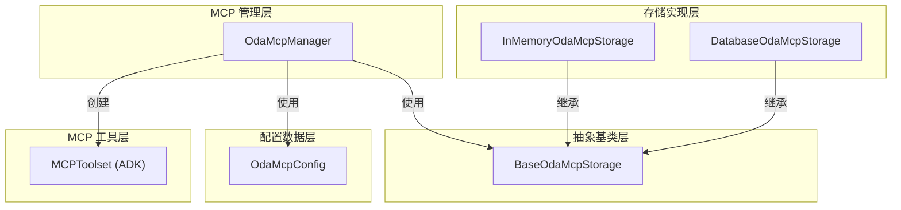
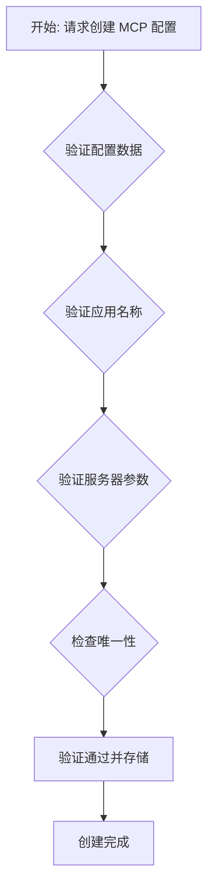
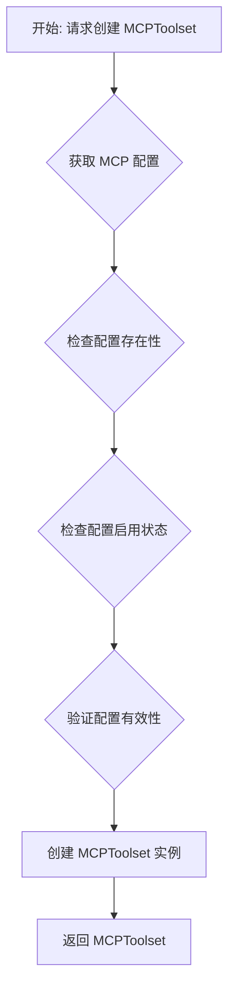
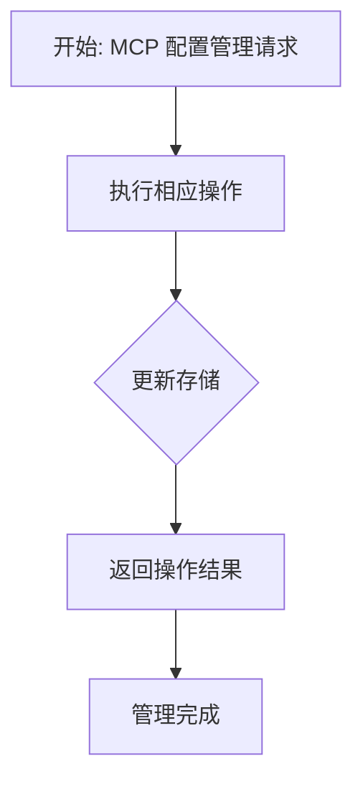

# OdaMcpManager 模块设计文档

## 1. 概述

`OdaMcpManager` 是 OneDragon-Agent 的 MCP 配置和工具统一管理器，负责 `OdaMcpConfig` 配置的 CRUD 操作、MCPToolset 的创建和管理。该管理器遵循 ADK 的 MCPToolset 设计模式，为系统提供灵活的 MCP 服务集成能力。

## 2. 架构总览

`OdaMcpManager` 采用抽象基类模式设计，通过继承 `BaseOdaMcpStorage` 实现不同的持久化策略。该设计与 ADK 的 MCPToolset 架构保持一致，通过抽象接口统一不同的存储实现，同时提供 MCPToolset 的创建和管理功能。



## 3. 核心概念

*   **`OdaMcpManager`**: MCP 配置和工具管理器，负责 MCP 配置的 CRUD 操作和 MCPToolset 创建管理
*   **`BaseOdaMcpStorage`**: MCP 存储抽象基类，定义了统一的 MCP 管理接口
*   **`InMemoryOdaMcpStorage`**: MCP 内存存储实现，适合开发和测试场景
*   **`DatabaseOdaMcpStorage`**: MCP 数据库存储实现，提供持久化存储
*   **`OdaMcpConfig`**: MCP 配置数据类，包含 MCP 服务器的所有配置信息
*   **`MCPToolset`**: ADK 原生的 MCP 工具集合，用于连接外部 MCP 服务器
*   **应用名称隔离**: 通过 `app_name` 字段确保不同应用的 MCP 配置相互隔离
*   **连接管理**: 管理 MCP 服务器的连接参数和生命周期

## 4. 职责与功能

### 4.1 核心职责

`OdaMcpManager` 承担以下核心职责：

*   **MCP 配置管理**: 负责 `OdaMcpConfig` 的创建、读取、更新和删除操作
*   **MCPToolset 创建**: 根据 MCP 配置创建 ADK 原生的 MCPToolset 实例
*   **配置验证**: 验证 MCP 配置的完整性和有效性
*   **应用隔离**: 通过 `app_name` 字段确保不同应用的 MCP 配置相互隔离

### 4.2 核心功能

#### **配置管理功能**:
- **创建 MCP 配置**: 支持通过配置对象创建新的 MCP 配置
- **读取 MCP 配置**: 支持通过 mcp_id 查询特定配置
- **更新 MCP 配置**: 支持更新现有配置的各个字段
- **删除 MCP 配置**: 支持删除指定配置
- **列表查询**: 支持获取所有 MCP 配置的列表

#### **MCPToolset 创建功能**:
- **创建 MCPToolset**: 根据 MCP 配置创建 ADK 原生的 MCPToolset 实例
- **连接参数转换**: 将 MCP 配置转换为 ADK 需要的连接参数格式
- **工具过滤**: 支持通过 tool_filter 参数过滤 MCP 服务器暴露的工具

## 5. OdaMcpConfig 配置项详解

### 5.1 配置项

`OdaMcpConfig` 是 MCP 配置的数据类，包含以下可配置项：

| 配置项 | 类型 | 必填 | 说明 | 示例 |
|--------|------|------|------|------|
| `mcp_id` | `str` | 是 | MCP 配置的唯一标识符 | `"filesystem_mcp"` |
| `app_name` | `str` | 是 | 应用名称，用于隔离不同应用的 MCP 配置 | `"weather_app"` |
| `name` | `str` | 是 | MCP 配置的显示名称 | `"文件系统 MCP"` |
| `description` | `str` | 是 | MCP 配置的描述信息 | `"提供文件系统操作能力"` |
| `server_type` | `str` | 是 | 服务器类型：`'stdio'`、`'sse'` 或 `'http'` | `"stdio"` |
| `command` | `str` | 否 | 启动 MCP 服务器的命令（stdio 类型） | `"npx"` |
| `args` | `list[str]` | 否 | 启动 MCP 服务器的参数（stdio 类型） | `["-y", "@modelcontextprotocol/server-filesystem"]` |
| `url` | `str` | 否 | MCP 服务器的 URL（sse 或 http 类型） | `"http://localhost:8090/sse"` |
| `headers` | `dict[str, str]` | 否 | HTTP 请求头（sse 或 http 类型） | `{"Authorization": "Bearer token"}` |
| `env` | `dict[str, str]` | 否 | 环境变量 | `{"API_KEY": "secret"}` |
| `tool_filter` | `list[str]` | 否 | 工具过滤器，只加载指定的工具 | `["read_file", "list_directory"]` |
| `timeout` | `int` | 否 | 连接超时时间（秒） | `30` |
| `retry_count` | `int` | 否 | 重试次数 | `3` |

### 5.2 配置约束

- **唯一性约束**: `mcp_id` 在同一 `app_name` 下必须唯一
- **服务器类型约束**: `server_type` 必须是 `'stdio'`、`'sse'` 或 `'http'`
- **参数完整性**: stdio 类型必须提供 `command`，sse 和 http 类型必须提供 `url`
- **应用隔离**: 不同 `app_name` 下的配置相互独立，可以存在相同的 `mcp_id`
- **配置验证**: 所有配置都必须通过有效性验证，确保连接参数正确

## 6. 核心接口定义

### 6.1 BaseOdaMcpStorage 抽象基类

```python
from abc import ABC, abstractmethod
from typing import List, Optional
from one_dragon_agent.core.agent.config.oda_mcp_config import OdaMcpConfig


class BaseOdaMcpStorage(ABC):
    """MCP 存储抽象基类，定义了统一的 MCP 管理接口"""
    
    @abstractmethod
    async def create_config(self, config: OdaMcpConfig) -> None:
        """创建 MCP 配置"""
        pass
    
    @abstractmethod
    async def get_config(self, mcp_id: str) -> Optional[OdaMcpConfig]:
        """获取 MCP 配置"""
        pass
    
    @abstractmethod
    async def update_config(self, config: OdaMcpConfig) -> None:
        """更新 MCP 配置"""
        pass
    
    @abstractmethod
    async def delete_config(self, mcp_id: str) -> None:
        """删除 MCP 配置"""
        pass
    
    @abstractmethod
    async def list_configs(self) -> List[OdaMcpConfig]:
        """列出所有 MCP 配置"""
        pass
```

### 6.2 InMemoryOdaMcpStorage 内存 MCP 存储

```python
from typing import List, Optional
from one_dragon_agent.core.agent.config.oda_mcp_config import OdaMcpConfig


class InMemoryOdaMcpStorage(BaseOdaMcpStorage):
    """MCP 内存服务实现，适合开发和测试场景"""
    
    def __init__(self):
        """初始化内存 MCP 服务"""
        self._configs: dict[str, OdaMcpConfig] = {}
    
    async def create_config(self, config: OdaMcpConfig) -> None:
        """创建 MCP 配置"""
        pass
    
    async def get_config(self, mcp_id: str) -> Optional[OdaMcpConfig]:
        """获取 MCP 配置"""
        pass
    
    async def update_config(self, config: OdaMcpConfig) -> None:
        """更新 MCP 配置"""
        pass
    
    async def delete_config(self, mcp_id: str) -> None:
        """删除 MCP 配置"""
        pass
    
    async def list_configs(self) -> List[OdaMcpConfig]:
        """列出所有 MCP 配置"""
        pass
```

### 6.3 DatabaseOdaMcpStorage 数据库 MCP 存储

```python
from typing import List, Optional
from one_dragon_agent.core.agent.config.oda_mcp_config import OdaMcpConfig


class DatabaseOdaMcpStorage(BaseOdaMcpStorage):
    """MCP 数据库服务实现，提供持久化存储"""
    
    def __init__(self, db_url: str):
        """初始化数据库 MCP 服务"""
        self.db_url = db_url
    
    async def create_config(self, config: OdaMcpConfig) -> None:
        """创建 MCP 配置"""
        pass
    
    async def get_config(self, mcp_id: str) -> Optional[OdaMcpConfig]:
        """获取 MCP 配置"""
        pass
    
    async def update_config(self, config: OdaMcpConfig) -> None:
        """更新 MCP 配置"""
        pass
    
    async def delete_config(self, mcp_id: str) -> None:
        """删除 MCP 配置"""
        pass
    
    async def list_configs(self) -> List[OdaMcpConfig]:
        """列出所有 MCP 配置"""
        pass
```

### 6.4 OdaMcpManager MCP 管理器

```python
from typing import Dict, Optional, List
from one_dragon_agent.core.tool.mcp.oda_mcp_config import OdaMcpConfig
from one_dragon_agent.core.tool.mcp.oda_mcp_config_storage import OdaMcpConfigStorage


class OdaMcpManager:
    """MCP 配置和工具管理器，提供统一的 MCP 管理接口"""
    
    def __init__(self):
        """初始化 MCP 管理器"""
        # 内置配置内存存储
        self._build_in_configs: Dict[str, OdaMcpConfig] = {}
        
        # 自定义配置存储服务
        self._custom_config_storage: OdaMcpConfigStorage = OdaMcpConfigStorage()
    
    async def register_build_in_config(self, config: OdaMcpConfig) -> None:
        """注册内置 MCP 配置（存储在独立内存中，无需持久化）
        
        Args:
            config: MCP 配置对象
            
        Raises:
            ValueError: 如果配置参数无效或冲突
        """
        pass
    
    async def register_custom_config(self, config: OdaMcpConfig) -> None:
        """注册自定义 MCP 配置（需要持久化）
        
        Args:
            config: MCP 配置对象
            
        Raises:
            ValueError: 如果配置参数无效或冲突
        """
        pass
    
    async def unregister_build_in_config(self, app_name: str, tool_id: str) -> None:
        """注销内置 MCP 配置
        
        Args:
            app_name: 应用名称
            tool_id: 工具标识符
            
        Raises:
            PermissionError: 内置配置通常不允许删除
        """
        pass
    
    async def unregister_custom_config(self, app_name: str, tool_id: str) -> None:
        """注销自定义 MCP 配置
        
        Args:
            app_name: 应用名称
            tool_id: 工具标识符
        """
        pass
    
    async def get_mcp_config(self, app_name: str, tool_id: str) -> Optional[OdaMcpConfig]:
        """获取 MCP 配置（支持查询内置和自定义配置）
        
        Args:
            app_name: 应用名称
            tool_id: 工具标识符
            
        Returns:
            MCP 配置对象或 None
        """
        pass
    
    async def list_mcp_configs(self, app_name: str) -> Dict[str, OdaMcpConfig]:
        """列出所有 MCP 配置（包括内置和自定义配置）
        
        Args:
            app_name: 应用名称过滤器
            
        Returns:
            配置字典，以全局标识符为键 (app_name:tool_id)
        """
        pass
    
    async def update_custom_config(self, app_name: str, tool_id: str, config: OdaMcpConfig) -> None:
        """更新自定义 MCP 配置（内置配置无法更新）
        
        Args:
            app_name: 应用名称
            tool_id: 工具标识符
            config: 新的 MCP 配置对象
            
        Raises:
            ValueError: 如果配置参数无效或 MCP 配置不存在
            PermissionError: 如果尝试更新内置配置
        """
        pass
```

## 7. 核心处理流程

### 7.1 MCP 配置创建流程



### 7.2 MCPToolset 创建流程



### 7.3 MCP 配置管理流程



## 8. MCP 服务器类型支持

### 8.1 Stdio 服务器

适用于本地进程通信，通过标准输入输出与 MCP 服务器交互：

```python
# stdio 类型的 MCP 配置示例
stdio_config = OdaMcpConfig(
    mcp_id="filesystem_stdio",
    app_name="file_app",
    name="文件系统 MCP (Stdio)",
    description="通过 stdio 连接的文件系统 MCP 服务器",
    server_type="stdio",
    command="npx",
    args=["-y", "@modelcontextprotocol/server-filesystem", "/path/to/folder"],
    tool_filter=["read_file", "list_directory"]
)
```

### 8.2 SSE 服务器

适用于 HTTP 服务器通信，通过 Server-Sent Events 与 MCP 服务器交互：

```python
# sse 类型的 MCP 配置示例
sse_config = OdaMcpConfig(
    mcp_id="web_api_sse",
    app_name="web_app",
    name="Web API MCP (SSE)",
    description="通过 SSE 连接的 Web API MCP 服务器",
    server_type="sse",
    url="http://localhost:8090/sse",
    headers={"Authorization": "Bearer your-token"},
    tool_filter=["fetch_data", "submit_form"]
)
```

### 8.3 HTTP 服务器

适用于标准 HTTP 服务器通信，通过 REST API 与 MCP 服务器交互：

```python
# http 类型的 MCP 配置示例
http_config = OdaMcpConfig(
    mcp_id="web_api_http",
    app_name="web_app",
    name="Web API MCP (HTTP)",
    description="通过 HTTP 连接的 Web API MCP 服务器",
    server_type="http",
    url="http://localhost:8080/mcp",
    headers={"Authorization": "Bearer your-token", "Content-Type": "application/json"},
    tool_filter=["get_data", "post_data", "delete_resource"]
)
```
