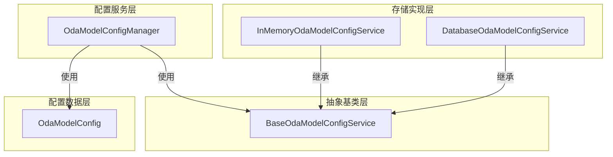

# OdaModelConfigManager 模块设计文档

## 1. 概述

`OdaModelConfigManager` 是 OneDragon-Agent 的大模型配置管理器，负责 `OdaModelConfig` 配置的创建、存储、检索和管理。该管理器遵循 ADK SessionService 的设计模式，支持内存和数据库两种持久化方式，为系统提供灵活的大模型配置管理能力。

## 2. 架构总览

`OdaModelConfigManager` 采用抽象基类模式设计，通过继承 `BaseOdaModelConfigService` 实现不同的持久化策略。该设计与 ADK 的 `BaseSessionService` 架构保持一致，通过抽象接口统一不同的存储实现。



## 3. 核心概念

*   **`OdaModelConfigManager`**: 大模型配置管理器，负责配置的 CRUD 操作和持久化管理
*   **`BaseOdaModelConfigService`**: OdaModel配置服务抽象基类，定义了统一的配置管理接口
*   **`InMemoryOdaModelConfigService`**: OdaModel内存配置服务实现，适合开发和测试场景
*   **`DatabaseOdaModelConfigService`**: OdaModel数据库配置服务实现，提供持久化存储
*   **`OdaModelConfig`**: 大模型配置数据类，包含大模型的所有配置信息
*   **服务模式**: 采用服务注入模式，支持运行时切换不同的配置服务实现

## 4. 职责与功能

### 4.1 核心职责

`OdaModelConfigManager` 承担以下核心职责：

*   **配置管理**: 负责 `OdaModelConfig` 的创建、读取、更新和删除操作
*   **服务管理**: 提供统一的配置服务接口，支持不同的存储实现
*   **配置验证**: 验证配置数据的完整性和有效性
*   **服务注入**: 支持通过依赖注入的方式使用不同的配置服务
*   **并发安全**: 确保多线程环境下的配置访问安全性

### 4.2 核心功能

#### **配置管理功能**:
- **创建配置**: 支持通过配置对象创建新的大模型配置
- **读取配置**: 支持通过 model_id 查询特定配置
- **更新配置**: 支持更新现有配置的各个字段
- **删除配置**: 支持删除指定配置
- **列表查询**: 支持获取所有配置的列表

#### **服务实现功能**:
- **InMemoryConfigService**: 内存存储实现，数据在进程重启后丢失，适合开发和测试
- **DatabaseConfigService**: 数据库存储实现，支持持久化存储，适合生产环境
- **服务切换**: 支持运行时切换不同的配置服务实现
- **扩展性**: 支持添加新的存储实现（如文件存储、云存储等）

#### **服务特性**:
- **统一接口**: 所有存储实现都继承自 `BaseConfigService`，提供统一的 API
- **异步操作**: 所有操作都是异步的，符合 ADK 的异步优先原则
- **错误处理**: 统一的异常处理机制，便于错误追踪和处理

## 5. OdaModelConfig 配置项详解

### 5.1 配置项

`OdaModelConfig` 是大模型配置的数据类，包含以下可配置项：

| 配置项 | 类型 | 必填 | 说明 | 示例 |
|--------|------|------|------|------|
| `app_name` | `str` | 是 | 用于标识所属的应用程序 同 adk-python 的定义 | `"weather_app"` |
| `model_id` | `str` | 是 | 大模型唯一标识符 | `"gemini-2.0-flash-config"` |
| `base_url` | `str` | 是 | 大模型 API 基础 URL | `"https://api.example.com"` |
| `api_key` | `str` | 是 | 访问大模型 API 的密钥 | `"sk-..."` |
| `model` | `str` | 是 | 实际使用的模型名称 | `"gemini-2.0-flash"` |

### 5.2 配置约束

- **唯一性约束**: `model_id` 在同一 `app_name` 下必须唯一
- **引用完整性**: 配置中的 URL 和 API Key 必须有效可访问
- **模型兼容性**: `model` 必须是目标 API 服务支持的模型名称
- **应用隔离**: 不同 `app_name` 下的配置相互独立，可以存在相同的 `model_id`

## 6. 核心接口定义

### 6.1 BaseOdaModelConfigService 抽象基类

```python
from abc import ABC, abstractmethod
from typing import List, Optional
from one_dragon_agent.core.model.oda_model_config import OdaModelConfig


class BaseOdaModelConfigService(ABC):
    """OdaModel配置服务抽象基类，定义了统一的配置管理接口"""
    
    @abstractmethod
    async def create_config(self, config: OdaModelConfig) -> None:
        """创建配置
        
        Args:
            config: 要创建的配置对象
        """
        pass
    
    @abstractmethod
    async def get_config(self, model_id: str) -> Optional[OdaModelConfig]:
        """获取配置
        
        Args:
            model_id: 大模型唯一标识符
            
        Returns:
            配置对象，如果不存在则返回 None
        """
        pass
    
    @abstractmethod
    async def update_config(self, config: OdaModelConfig) -> None:
        """更新配置
        
        Args:
            config: 要更新的配置对象
        """
        pass
    
    @abstractmethod
    async def delete_config(self, model_id: str) -> None:
        """删除配置
        
        Args:
            model_id: 要删除的大模型唯一标识符
        """
        pass
    
    @abstractmethod
    async def list_configs(self) -> List[OdaModelConfig]:
        """列出所有配置
        
        Returns:
            所有配置对象的列表
        """
        pass
```

### 6.2 InMemoryOdaModelConfigService 内存配置服务

```python
from typing import List, Optional
from one_dragon_agent.core.model.oda_model_config import OdaModelConfig


class InMemoryOdaModelConfigService(BaseOdaModelConfigService):
    """OdaModel内存配置服务实现，适合开发和测试场景"""
    
    def __init__(self):
        """初始化内存配置服务"""
        self._configs: dict[str, OdaModelConfig] = {}
    
    async def create_config(self, config: OdaModelConfig) -> None:
        """创建配置"""
        self._configs[config.model_id] = config
    
    async def get_config(self, model_id: str) -> Optional[OdaModelConfig]:
        """获取配置"""
        return self._configs.get(model_id)
    
    async def update_config(self, config: OdaModelConfig) -> None:
        """更新配置"""
        if config.model_id in self._configs:
            self._configs[config.model_id] = config
    
    async def delete_config(self, model_id: str) -> None:
        """删除配置"""
        self._configs.pop(model_id, None)
    
    async def list_configs(self) -> List[OdaModelConfig]:
        """列出所有配置"""
        return list(self._configs.values())
```

### 6.3 DatabaseOdaModelConfigService 数据库配置服务

```python
from typing import List, Optional
from one_dragon_agent.core.model.oda_model_config import OdaModelConfig


class DatabaseOdaModelConfigService(BaseOdaModelConfigService):
    """OdaModel数据库配置服务实现，提供持久化存储"""
    
    def __init__(self, db_url: str):
        """初始化数据库配置服务
        
        Args:
            db_url: 数据库连接 URL
        """
        self.db_url = db_url
        # 初始化数据库连接和表结构
    
    async def create_config(self, config: OdaModelConfig) -> None:
        """创建配置"""
        # 实现数据库存储逻辑
        pass
    
    async def get_config(self, model_id: str) -> Optional[OdaModelConfig]:
        """获取配置"""
        # 实现数据库查询逻辑
        pass
    
    async def update_config(self, config: OdaModelConfig) -> None:
        """更新配置"""
        # 实现数据库更新逻辑
        pass
    
    async def delete_config(self, model_id: str) -> None:
        """删除配置"""
        # 实现数据库删除逻辑
        pass
    
    async def list_configs(self) -> List[OdaModelConfig]:
        """列出所有配置"""
        # 实现数据库查询所有配置的逻辑
        pass
```

### 6.4 OdaModelConfigManager 配置管理器

#### 核心方法定义

```python
from one_dragon_agent.core.context.oda_context_config import OdaContextConfig
from one_dragon_agent.core.model.base_oda_model_config_service import BaseOdaModelConfigService
from one_dragon_agent.core.model.oda_model_config import OdaModelConfig

# Special ID for default LLM configuration
DEFAULT_LLM_CONFIG_ID = "__default_llm_config"


class OdaModelConfigManager:
    """大模型配置管理器，提供服务注入和统一的配置管理接口"""
    
    def __init__(self, config_service: BaseOdaModelConfigService, context_config: OdaContextConfig):
        """初始化配置管理器
        
        初始化配置管理器时，会从注入的 OdaContextConfig 中读取默认LLM配置。
        如果 OdaContextConfig 中默认配置设置完整，则创建默认配置实例并缓存在内存中。
        后续调用 get_default_config() 直接返回缓存实例，无需重复处理配置。
        
        Args:
            config_service: 配置服务实例，可以是任何继承自 BaseOdaModelConfigService 的实现
            context_config: 上下文配置对象，包含从环境变量统一读取的默认LLM配置
            
        Note:
            采用统一注入模式，OdaModelManager 不直接读取环境变量，
            而是由 OdaContext 统一管理配置注入
        """
        self.config_service = config_service
        self._default_config: OdaModelConfig | None = None
        
        # Create default config from context config if all required fields are present
        if (context_config.default_llm_base_url and 
            context_config.default_llm_api_key and 
            context_config.default_llm_model):
            self._default_config = OdaModelConfig(
                app_name="__default_app",
                model_id=DEFAULT_LLM_CONFIG_ID,
                base_url=context_config.default_llm_base_url,
                api_key=context_config.default_llm_api_key,
                model=context_config.default_llm_model
            )
    
    async def create_config(self, config: OdaModelConfig) -> None:
        """创建大模型配置
        
        创建持久化的大模型配置，配置将被存储到底层服务中。
        默认配置不允许通过此方法创建，因为它基于环境变量自动生成。
        
        Args:
            config: 要创建的配置对象
            
        Raises:
            ValueError: 当尝试创建默认配置时抛出异常
        """
        if config.model_id == DEFAULT_LLM_CONFIG_ID:
            raise ValueError("Default configuration cannot be created manually. "
                           "It is automatically generated from environment variables.")
        
        await self.config_service.create_config(config)
    
    async def get_config(self, model_id: str) -> OdaModelConfig | None:
        """获取大模型配置
        
        支持获取持久化配置和默认配置。当请求默认配置ID时，
        返回内存中的默认配置实例（不进行持久化查询）。
        
        Args:
            model_id: 大模型唯一标识符，支持特殊默认配置ID "__default_llm_config"
            
        Returns:
            配置对象，如果不存在则返回 None
            
        Note:
            默认配置ID "__default_llm_config" 为保留ID，用于标识基于环境变量的默认配置
        """
        # Return default config directly if requested
        if model_id == DEFAULT_LLM_CONFIG_ID:
            return self._default_config
        
        # Otherwise delegate to the config service
        return await self.config_service.get_config(model_id)
    
    def get_default_config(self) -> OdaModelConfig | None:
        """获取默认大模型配置
        
        直接返回初始化时缓存的默认配置实例，不涉及持久化操作。
        默认配置在管理器初始化时从注入的 OdaContextConfig 中一次性读取，
        该配置由 OdaContext 统一从环境变量 ODA_DEFAULT_LLM_BASE_URL、
        ODA_DEFAULT_LLM_API_KEY、ODA_DEFAULT_LLM_MODEL 中读取并验证，
        使用固定的特殊ID "__default_llm_config"。
        
        Returns:
            默认配置对象，如果 OdaContextConfig 中未设置默认配置则返回 None
            
        Note:
            该方法直接返回缓存实例，性能高效，适合频繁调用获取默认配置
        """
        return self._default_config
    
    async def update_config(self, config: OdaModelConfig) -> None:
        """更新大模型配置
        
        更新持久化的大模型配置。默认配置不允许通过此方法更新，
        因为默认配置基于 OdaContextConfig，需要通过修改环境变量并重启系统来更新。
        
        Args:
            config: 要更新的配置对象
            
        Raises:
            ValueError: 当尝试更新默认配置时抛出异常
        """
        if config.model_id == DEFAULT_LLM_CONFIG_ID:
            raise ValueError("Default configuration cannot be updated manually. "
                           "Update it through environment variables and restart the system.")
        
        await self.config_service.update_config(config)
    
    async def delete_config(self, model_id: str) -> None:
        """删除大模型配置
        
        删除持久化的大模型配置。默认配置不允许删除，
        因为它是基于 OdaContextConfig 的系统级配置。
        
        Args:
            model_id: 要删除的大模型唯一标识符
            
        Raises:
            ValueError: 当尝试删除默认配置时抛出异常
        """
        if model_id == DEFAULT_LLM_CONFIG_ID:
            raise ValueError("Default configuration cannot be deleted as it is a system-level configuration.")
        
        await self.config_service.delete_config(model_id)
    
    async def list_configs(self) -> list[OdaModelConfig]:
        """获取所有大模型配置
        
        返回系统中所有可用的大模型配置，包括：
        - 持久化配置：通过 create_config 创建的自定义配置
        - 内置默认配置：基于 OdaContextConfig 生成的默认配置
        
        Returns:
            包含所有配置对象的列表，默认配置总是出现在列表末尾
            
        Note:
            该方法提供完整的配置视图，便于上层应用了解所有可用的模型配置
        """
        # Get all persistent configurations
        configs = await self.config_service.list_configs()
        
        # Add default configuration if it exists
        if self._default_config:
            configs.append(self._default_config)
        
        return configs
```