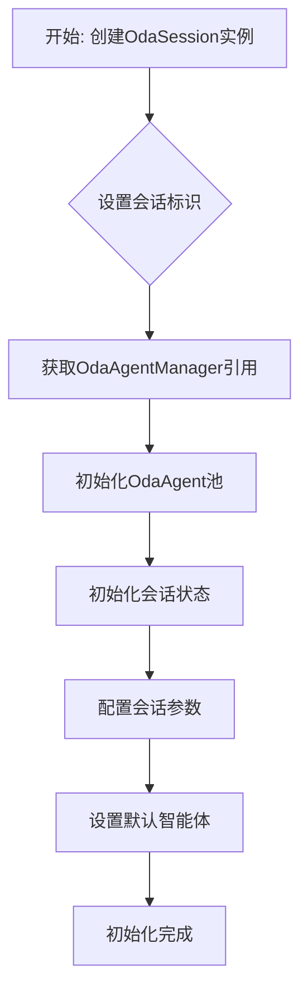
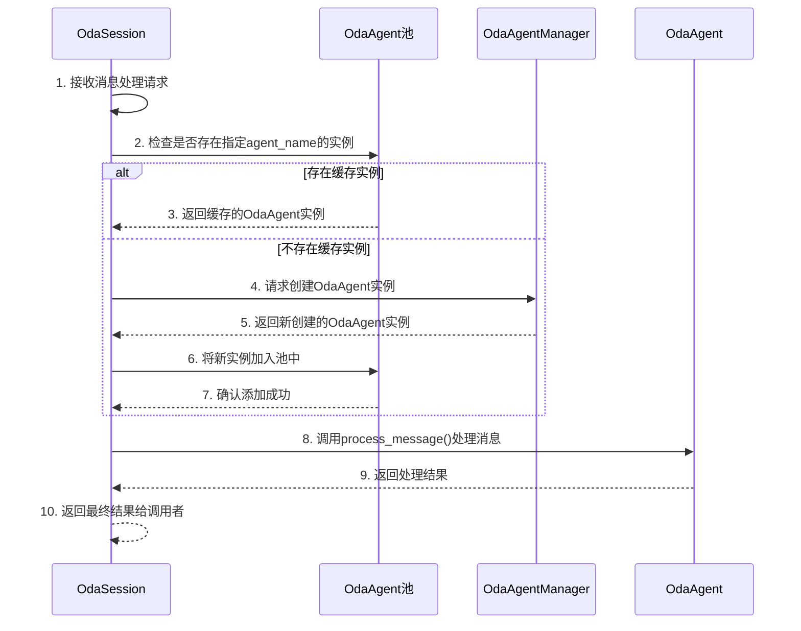

# OdaSession 模块设计文档

## 1. 概述

`OdaSession` 是 OneDragon-Agent 的会话实例层，由 `OdaSessionManager` 创建，代表一个独立的、隔离的用户对话会话。作为 ADK 原生组件的业务包装器，它为上层应用提供业务友好的接口，封装 ADK 的复杂性，支持多智能体场景下的无缝切换和协作。

`OdaSession` 采用面向会话的设计模式，每个实例都是一个完整的运行环境，包含会话状态、智能体池和业务逻辑处理能力，确保会话间的数据安全和状态隔离。

## 2. 架构总览

`OdaSession` 作为系统的核心业务执行单元，连接管理层和执行层。它通过 `OdaAgentManager` 获取智能体实例，通过智能体池管理多个 `OdaAgent` 实例，为上层应用提供统一的会话操作接口。

`OdaSession` 采用组合模式设计，内部持有 `OdaAgentManager` 引用和 `OdaAgent` 实例池，通过业务接口封装 ADK 原生的复杂操作，提供简洁易用的会话管理能力。工具管理由 `OdaAgentManager` 内部处理，`OdaSession` 不需要关注工具实例的创建和管理。

## 3. 核心概念

*   **`OdaSession`**: 会话实例层组件，代表一个独立的用户对话会话，是 ADK 原生组件的业务包装器。
*   **`OdaAgentManager`**: 由 `OdaContext` 持有的智能体管理器，负责创建和管理 `OdaAgent` 实例。
*   **`OdaAgent池`**: `OdaSession` 内部的智能体实例缓存池，按 `agent_name` 缓存已创建的 `OdaAgent` 实例。
*   **会话标识三元组**: 唯一标识会话的组合 (`app_name`, `user_id`, `session_id`)。
*   **多智能体支持**: 同一会话中支持多个智能体的创建、管理和无缝切换。
*   **业务接口封装**: 将 ADK 原生操作封装为业务友好的接口，隐藏复杂性。
*   **会话状态管理**: 管理会话的业务状态、配置信息和用户上下文。

## 4. 职责与功能

### 4.1 核心职责

`OdaSession` 承担以下核心职责：

*   **消息处理功能**: 提供用户消息发送、智能体选择、状态查询等核心业务功能。
*   **会话业务逻辑**: 负责会话的业务逻辑处理、状态管理和生命周期控制。
*   **多智能体支持**: 支持同一会话中多个智能体的无缝切换和协作。
*   **状态管理**: 管理会话的业务状态和用户上下文。
*   **生命周期管理**: 负责会话资源的分配、使用和清理。
*   **用户接口**: 提供友好的用户接口，封装 ADK 的复杂性。
*   **智能体调用**: 通过调用 `OdaAgent` 的业务方法来处理消息，不直接操作 ADK 的 `Runner`。

### 4.2 持有组件

`OdaSession` 依赖并持有以下核心组件：

*   **`OdaAgentManager`**: 作为智能体管理的核心组件，用于创建和获取 `OdaAgent` 实例。
*   **`OdaAgent池`**: 作为智能体实例的缓存池，按 `agent_name` 缓存已创建的 `OdaAgent` 实例。
*   **会话标识**: 持有会话的三元组标识 (`app_name`, `user_id`, `session_id`)，确保会话隔离。
*   **会话状态**: 管理会话的业务状态、配置信息和用户上下文。
*   **运行时配置**: 持有会话的运行时配置参数和行为设置。

### 4.3 核心功能

#### **消息处理功能**:
- 处理用户输入消息，支持指定智能体名称
- 智能体选择和调用逻辑
- 消息处理结果的封装和返回
- 异常情况的处理和错误信息返回

#### **会话业务逻辑功能**:
- 会话状态的管理和维护
- 用户上下文的保存和恢复
- 会话配置的动态更新
- 业务规则的执行和验证

#### **多智能体支持功能**:
- 同一会话中多个智能体的管理
- 智能体间的无缝切换
- 智能体协作的协调
- 智能体状态的独立管理

#### **OdaAgent 池管理功能**:
- 按名称缓存和复用 `OdaAgent` 实例
- 智能体实例的懒加载创建
- 池中实例的生命周期管理
- 并发安全的实例访问控制

#### **生命周期管理功能**:
- 会话初始化和资源配置
- 会话运行状态监控
- 会话资源的动态分配
- 会话结束时的资源清理

#### **状态管理功能**:
- 会话业务状态的持久化
- 用户上下文的管理
- 会话元数据的维护
- 状态变更的事件通知

## 5. 核心接口定义

`OdaSession` 提供清晰的会话操作接口：

```python
class OdaSession:
    def __init__(self, app_name: str, user_id: str, session_id: str, agent_manager: OdaAgentManager):
        """初始化OdaSession，传入会话标识和智能体管理器
        
        Args:
            app_name: 应用名称
            user_id: 用户标识
            session_id: 会话标识
            agent_manager: 智能体管理器实例
        """
    
    async def process_message(self, message: str, agent_name: str = None) -> str:
        """处理用户消息，返回最终响应
        
        Args:
            message: 用户输入的消息
            agent_name: 指定的智能体名称，如果为None则使用默认智能体
            
        Returns:
            智能体的最终响应结果
        """
        
    async def cleanup(self) -> None:
        """清理会话资源"""
```

## 7. 核心处理流程

### 7.1 会话初始化流程



### 7.2 消息处理流程



**流程详解**:
1.  **消息请求**: `OdaSession` 接收用户的消息处理请求。
2.  **池检查**: 首先检查 `OdaAgent` 池中是否存在指定 `agent_name` 的实例。
3.  **实例复用**: 如果存在缓存实例，直接返回，避免重复创建。
4.  **实例创建**: 如果不存在缓存实例，向 `OdaAgentManager` 请求创建新实例。
5.  **池更新**: 将新创建的实例添加到 `OdaAgent` 池中，供后续使用。
6.  **消息处理**: 调用 `OdaAgent` 的 `process_message()` 方法处理消息。
7.  **结果返回**: `OdaAgent` 返回处理结果，`OdaSession` 将最终结果返回给调用者。

## 8. 资源隔离与安全

### 8.1 会话隔离机制

`OdaSession` 实现严格的会话隔离策略：

*   **实例隔离**: 每个 `OdaSession` 实例都是独立的运行环境，不会共享状态。
*   **智能体隔离**: 每个会话的 `OdaAgent` 实例完全隔离，避免状态污染。
*   **状态隔离**: 会话的业务状态相互独立，不会出现状态污染。
*   **资源隔离**: 会话相关的资源按会话隔离管理，确保资源使用的安全性。
*   **异常隔离**: 会话执行过程中的异常不会影响其他会话。

