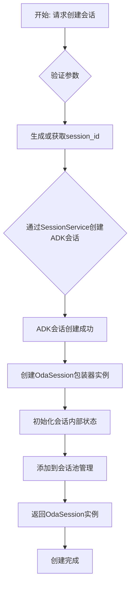
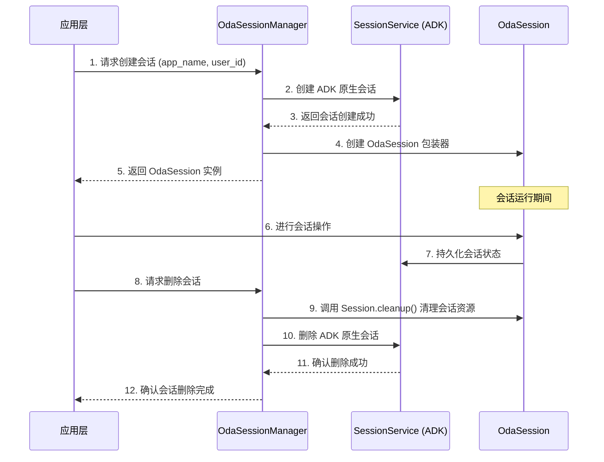

# OdaSessionManager 模块设计文档

## 1. 概述

`OdaSessionManager` 是 OneDragon-Agent 的会话管理层，由 `OdaContext` 持有，负责系统中所有会话实例的完整生命周期管理。作为会话管理的核心组件，它为上层应用提供标准化的会话操作接口，确保会话资源的合理分配和高效使用。

`OdaSessionManager` 通过 `SessionService` 提供的 ADK 原生能力，实现了会话数据的持久化存储和管理，支持多会话场景下的资源隔离和状态管理。

## 2. 架构总览

`OdaSessionManager` 作为 `OdaContext` 的核心管理组件之一，专注于会话层面的业务逻辑。它不直接处理具体的消息执行，而是通过 `OdaSession` 实例为上层应用提供会话级别的操作接口。

`OdaSessionManager` 采用面向会话的设计模式，每个会话都是独立的、隔离的运行环境，确保会话间的数据安全和状态隔离。

## 3. 核心概念

*   **`OdaSessionManager`**: 会话管理层组件，负责会话实例的完整生命周期管理。
*   **`SessionService` (ADK原生)**: 由 `OdaContext` 提供的会话服务，作为会话数据的底层存储引擎。
*   **`OdaSession`**: 代表一个独立的用户对话会话，是 ADK 原生组件的业务包装器。
*   **会话标识三元组**: 唯一标识会话的组合 (`app_name`, `user_id`, `session_id`)。
*   **生命周期管理**: 会话实例的创建、激活、监控、清理和销毁的完整流程。
*   **会话池**: 当前活跃的会话实例集合，用于会话的快速访问和管理。

## 4. SessionService 能力范围分析

### 4.1 SessionService 提供的核心能力

#### **基础 CRUD 操作**
- ✅ `create_session()`: 创建新会话，支持初始状态配置
- ✅ `get_session()`: 获取指定会话实例
- ✅ `delete_session()`: 删除会话实例及关联数据
- ✅ `list_sessions()`: 列出用户的所有会话
- ✅ `list_events()`: 列出会话的事件历史

#### **事件管理能力**
- ✅ `append_event()`: 向会话添加新事件，自动处理状态变更
- ✅ 事件版本控制: 支持事件的时间戳和版本管理
- ✅ 事件历史存储: 完整的事件序列持久化

#### **状态管理能力**
- ✅ 状态持久化: 会话状态的自动保存和恢复
- ✅ 状态作用域: 支持 `app:`、`user:`、`temp:` 等状态前缀
- ✅ 状态变更跟踪: 通过 `state_delta` 机制跟踪状态变更
- ✅ 并发安全: 状态更新的线程安全保障

#### **持久化机制**
- ✅ `InMemorySessionService`: 内存存储，适合开发和测试
- ✅ `DatabaseSessionService`: 数据库持久化，支持 SQLite 等数据库
- ✅ `VertexAiSessionService`: Google Cloud Vertex AI 托管服务
- ✅ 可插拔架构: 支持自定义持久化后端实现

### 4.2 OdaSessionManager 需要额外实现的功能

#### **会话池管理机制**
- ✅ **会话实例缓存**: 在内存中缓存活跃的 `OdaSession` 实例
- ✅ **快速访问机制**: 实现 O(1) 时间复杂度的会话查找
- ✅ **实例复用策略**: 减少重复创建 `OdaSession` 实例的开销
- ✅ **内存使用控制**: 限制缓存的会话实例数量，防止内存溢出

#### **生命周期监控和管理**
- ✅ **超时检测机制**: 识别长时间未活跃的会话实例
- ✅ **自动清理流程**: 定期清理超时会话，释放系统资源

#### **性能优化和资源控制**
- ✅ **并发会话限制**: 控制同时活跃的会话数量
- 🔴 **资源使用监控**: 跟踪会话的资源消耗情况

#### **业务逻辑封装**
- ✅ **业务友好接口**: 将 ADK 原生操作封装为业务友好的接口
- ✅ **异常处理机制**: 统一处理各种异常情况，提供清晰的错误信息
- 🔴 **配置管理**: 支持会话级别的配置参数管理

## 5. 职责与功能

### 5.1 核心职责

`OdaSessionManager` 承担以下核心职责：

*   **会话实例管理**: 负责 `OdaSession` 实例的创建、查找、更新和删除操作。
*   **生命周期控制**: 管理会话实例的生命周期，包括超时清理和资源释放。
*   **会话级别接口**: 提供会话级别的查询、统计和监控接口。
*   **协调操作**: 作为 `OdaContext` 和 `OdaSession` 之间的桥梁，协调会话相关操作。
*   **资源管理**: 确保会话资源的合理分配和使用。

### 5.2 持有组件

`OdaSessionManager` 依赖并持有以下核心组件：

*   **`SessionService`**: 作为会话数据的底层存储引擎，提供 ADK 原生的会话 CRUD 操作能力。
*   **`OdaAgentManager`**: 作为智能体管理器，负责创建和管理 `OdaAgent` 实例。
*   **会话实例池**: 当前活跃的 `OdaSession` 实例集合，提供快速的会话访问机制。

### 5.3 核心功能

#### **会话池管理机制** 
- 在内存中缓存活跃的 `OdaSession` 实例，提高访问效率
- 实现 O(1) 时间复杂度的会话查找机制
- 采用实例复用策略，减少重复创建 `OdaSession` 实例的开销
- 限制缓存的会话实例数量，防止内存溢出

#### **会话创建功能**: 
- 创建新的会话实例，初始化会话状态和事件历史
- 为会话分配唯一的标识符
- 配置会话的初始参数和权限设置

#### **会话查询功能**:
- 根据 app_name 和 user_id 查询用户的会话列表
- 根据会话 ID 获取特定会话实例
- 提供会话状态和元数据查询接口

#### **会话更新功能**:
- 更新会话的状态和配置信息
- 管理会话的活跃状态和超时设置
- 维护会话的访问权限和安全设置

#### **会话删除功能**:
- 删除指定的会话实例，释放相关资源
- 清理会话的历史数据和状态信息
- 确保数据安全和隐私保护

#### **生命周期监控**:
- 监控会话的活跃状态和超时情况
- 自动清理长时间未活跃的会话
- 维护系统资源使用效率

## 6. 核心接口定义

`OdaSessionManager` 提供清晰的会话管理接口：

```python
class OdaSessionManager:
    def __init__(self, session_service: BaseSessionService, agent_manager: OdaAgentManager) -> None:
        """初始化OdaSessionManager，传入SessionService和AgentManager实例
        
        Args:
            session_service: ADK原生会话服务实例
            agent_manager: 智能体管理器实例，用于创建OdaAgent实例
        """
    
    async def create_session(self, app_name: str, user_id: str, session_id: str = None) -> OdaSession:
        """创建新的会话实例
        
        Args:
            app_name: 应用名称
            user_id: 用户标识
            session_id: 可选的会话标识（如果为None则自动生成）
            
        Returns:
            OdaSession: 创建的会话实例
        """
        
    async def get_session(self, app_name: str, user_id: str, session_id: str) -> Optional[OdaSession]:
        """获取指定的会话实例
        
        Args:
            app_name: 应用名称
            user_id: 用户标识
            session_id: 会话标识
            
        Returns:
            OdaSession: 会话实例或None（如果未找到）
        """
        
    async def list_sessions(self, app_name: str, user_id: str) -> list[OdaSession]:
        """列出用户的所有会话实例
        
        Args:
            app_name: 应用名称
            user_id: 用户标识
            
        Returns:
            list[OdaSession]: 会话实例列表
        """
        
    async def delete_session(self, app_name: str, user_id: str, session_id: str) -> None:
        """删除指定的会话实例
        
        Args:
            app_name: 应用名称
            user_id: 用户标识
            session_id: 会话标识
        """
        
    async def cleanup_inactive_sessions(self, timeout_seconds: int) -> None:
        """清理超时的会话实例
        
        Args:
            timeout_seconds: 会话超时时间（秒）
        """
        
    async def set_concurrent_limit(self, max_concurrent_sessions: int) -> None:
        """设置并发会话数量限制
        
        Args:
            max_concurrent_sessions: 允许的最大并发会话数
        """
```

## 7. 核心处理流程

### 7.1 会话创建流程



### 7.2 会话查询和管理流程

应用层通过 `OdaSessionManager` 进行会话查询和管理。完整的会话操作流程请参考 **[核心架构设计文档](../architecture/core_architecture.md)** 中的相关流程图，未来详细的会话实例实现请参考 **[OdaSession 模块设计文档](oda_session.md)**。

核心流程：
1. 应用层通过 `OdaSessionManager` 的查询方法获取会话信息
2. 通过会话操作方法进行会话状态管理
3. `OdaSessionManager` 通过 `SessionService` 与 ADK 原生存储交互

### 7.3 会话生命周期管理流程



**流程详解**:
1.  **创建请求**: 应用层向 `OdaSessionManager` 发送会话创建请求。
2.  **ADK会话创建**: `OdaSessionManager` 使用 `SessionService` 创建 ADK 原生会话。
3.  **创建确认**: `SessionService` 返回会话创建成功的确认信息。
4.  **包装器创建**: `OdaSessionManager` 创建 `OdaSession` 实例作为业务包装器。
5.  **实例返回**: 将 `OdaSession` 实例返回给应用层使用。
6.  **会话操作**: 应用层通过 `OdaSession` 进行会话相关的操作。
7.  **状态持久化**: `OdaSession` 通过 `SessionService` 持久化会话状态。
8.  **删除请求**: 应用层请求删除指定的会话。
9.  **资源清理**: `OdaSessionManager` 清理会话级别的资源，包括调用 `OdaSession.cleanup()` 清理会话内部的智能体实例。
10. **ADK会话删除**: 通过 `SessionService` 删除 ADK 原生会话数据。
11. **删除确认**: `SessionService` 确认会话删除成功。
12. **操作完成**: 向应用层确认会话删除操作完成。

## 8. 资源隔离与安全

### 8.1 会话隔离机制

`OdaSessionManager` 实现严格的会话隔离策略：

*   **数据隔离**: 每个会话的数据完全隔离，通过 ADK 的会话标识三元组确保数据安全。
*   **状态隔离**: 会话的状态信息相互独立，不会出现状态污染。
*   **资源隔离**: 会话相关的资源（如智能体实例、临时文件）按会话隔离管理。
*   **权限隔离**: 会话级别的权限控制，确保用户只能访问自己的会话数据。

### 8.2 会话安全策略

*   **访问控制**: 基于 app_name 和 user_id 的访问控制机制。
*   **数据安全**: 敏感会话数据通过 ADK 的安全机制进行保护。

## 9. 性能与优化

### 9.1 会话池管理

`OdaSessionManager` 通过会话池机制优化性能：

*   **实例复用**: 活跃会话实例在内存中缓存，减少重复创建开销。
*   **快速访问**: 通过会话标识实现 O(1) 时间复杂度的会话查找。
*   **资源控制**: 限制同时活跃的会话数量，防止资源耗尽。

### 9.2 超时与并发管理

*   **自动清理**: 定期清理超时的会话，释放系统资源。
*   **活动检测**: 监控会话的活跃状态，识别闲置会话。
*   **并发控制**: 通过设置最大并发会话数来控制系统资源使用。

这个流程清晰地展示了 `OdaSessionManager` 作为会话管理层组件的核心作用：它统一管理会话生命周期，提供标准化的会话操作接口，确保会话资源的安全隔离和高效使用。