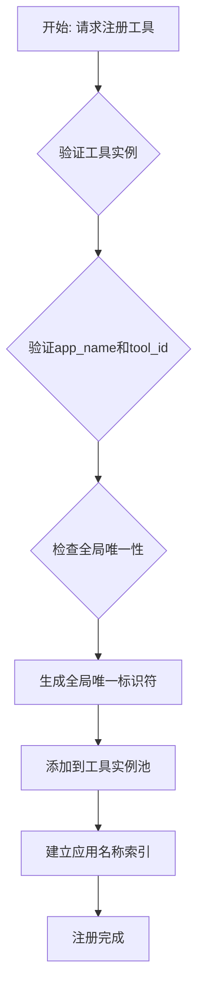
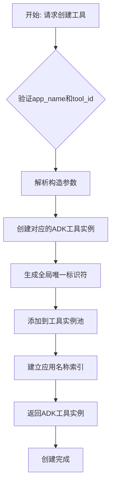
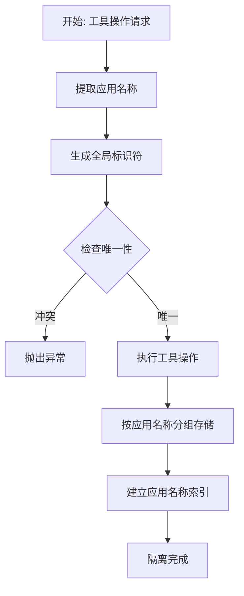

# OdaToolManager 模块设计文档

## 1. 概述

`OdaToolManager` 是 OneDragon-Agent 的工具管理层，由 `OdaContext` 持有，负责系统中所有 ADK 工具实例的管理。作为工具管理的核心组件，它为上层应用提供标准化的工具操作接口，确保工具资源的合理分配和高效使用。

`OdaToolManager` 只支持代码注册方式，所有工具都必须在启动时通过代码直接注册为 build-in 工具。工具的创建和管理基于 ADK-Python 的原生工具类，不提供额外的封装层。

## 2. 架构总览

`OdaToolManager` 作为 `OdaContext` 的核心管理组件之一，专注于工具层面的业务逻辑。它不直接处理具体的工具执行，而是通过管理 ADK 原生工具实例为上层应用提供工具级别的操作接口。

`OdaToolManager` 采用代码注册的设计模式，确保工具管理的简洁性和可预测性。所有工具都在启动时统一注册，避免了运行时的动态配置复杂性和不确定性。

## 3. 核心概念

*   **`OdaToolManager`**: 工具管理层组件，负责工具实例的注册和工具工厂方法。
*   **`ADK 原生工具类`**: 直接使用 ADK-Python 提供的工具类，如 `BaseTool`、`FunctionTool`、`GoogleSearchTool` 等。
*   **工具注册表**: 当前注册的 ADK 工具实例信息，用于工具的查询和创建。
*   **应用名称隔离**: 通过 `app_name` 字段确保不同应用的工具相互隔离，避免命名冲突。
*   **全局唯一标识符**: 使用 `app_name:tool_id` 格式确保工具在整个应用生态中的唯一性。

## 4. 职责与功能

### 4.1 核心职责

`OdaToolManager` 承担以下核心职责：

*   **工具实例注册**: 通过代码方式直接注册 ADK 原生工具实例，负责工具的正确初始化。
*   **应用名称隔离**: 通过 `app_name` 字段确保不同应用的工具相互隔离，避免命名冲突。
*   **工具工厂方法**: 提供根据 `app_name` 和 `tool_id` 创建工具实例的工厂方法。
*   **全局唯一标识符管理**: 为每个工具生成和维护全局唯一标识符，便于工具的追踪和管理。

### 4.2 持有组件

`OdaToolManager` 依赖并持有以下核心组件：

*   **工具注册表**: 当前注册的 ADK 工具实例信息，提供快速的实例查询机制。
*   **工具索引**: 基于 `app_name` 和 `tool_id` 的索引结构，支持高效的工具查询。

### 4.3 核心功能

#### **工具注册功能**:
- 提供 `register_tool` 接口直接注册 ADK 原生工具实例
- 提供 `register_function` 接口专门用于 Python 函数注册（支持同步和异步函数）
- 自动将 Python 函数包装为 ADK FunctionTool 实例
- 支持 ADK 内置工具的直接注册
- 支持自定义 ADK 工具的直接注册
- 强制要求 `app_name` 和 `tool_id` 参数，确保全局唯一性

#### **工具工厂功能**:
- 提供 `create_tool` 方法根据 `app_name` 和 `tool_id` 创建工具实例
- 支持基于应用名称和工具标识符的工具创建
- 为上层应用提供工具实例的工厂化创建能力

#### **应用名称隔离功能**:
- 通过 `app_name` 字段确保不同应用的工具隔离
- 支持工具的全局唯一标识符生成 (`app_name:tool_id`)
- 防止不同应用间的工具命名冲突
- 提供应用级别的工具查询和管理

#### **全局标识符管理功能**:
- 为每个工具生成和维护全局唯一标识符
- 提供基于全局标识符的工具查询功能
- 支持工具的全局追踪和监控
- 确保工具在整个应用生态中的唯一性

## 5. 核心接口定义

`OdaToolManager` 提供清晰的工具管理接口：

```python
from typing import Dict, Optional, List, Callable
from google.adk.tools import BaseTool, FunctionTool

class OdaToolManager:
    def __init__(self):
        """初始化OdaToolManager"""
        
    async def register_tool(self, tool: BaseTool, app_name: str, tool_id: str) -> None:
        """代码方式注册ADK工具实例
        
        Args:
            tool: 要注册的ADK工具实例
            app_name: 应用名称，用于工具隔离
            tool_id: 工具的唯一标识符，在app_name范围内必须唯一
            
        Raises:
            ValueError: 如果工具标识符冲突或参数无效
            TypeError: 如果tool不是BaseTool实例
        """
        
    async def register_function(self, func: Callable, app_name: str, tool_id: str) -> None:
        """注册Python函数并自动包装为FunctionTool
        
        Args:
            func: 要注册的Python函数（支持同步和异步函数）
            app_name: 应用名称，用于工具隔离
            tool_id: 工具的唯一标识符，在app_name范围内必须唯一
            
        Raises:
            ValueError: 如果工具标识符冲突或参数无效
            TypeError: 如果func不可调用
        """
        
            
            
    async def create_tool(self, app_name: str, tool_id: str, **kwargs) -> BaseTool:
        """根据app_name和tool_id构造并返回ADK工具实例
        
        该方法根据提供的app_name和tool_id，以及相关的构造参数，
        动态创建并返回对应的ADK工具实例。返回的都是ADK-Python中的原生类。
        
        Args:
            app_name: 应用名称
            tool_id: 工具标识符
            **kwargs: 工具构造所需的额外参数
            
        Returns:
            ADK工具实例
            
        Raises:
            ValueError: 如果app_name或tool_id无效，或构造参数不完整
            TypeError: 如果无法构造指定类型的工具
        """
        
    async def list_tools(self, app_name: Optional[str] = None) -> Dict[str, BaseTool]:
        """列出所有ADK工具实例
        
        Args:
            app_name: 可选的应用名称过滤器
            
        Returns:
            工具字典，key为全局标识符 (app_name:tool_id)，value为ADK工具实例
        """
        
    def get_global_identifier(self, app_name: str, tool_id: str) -> str:
        """生成工具的全局唯一标识符
        
        Args:
            app_name: 应用名称
            tool_id: 工具标识符
            
        Returns:
            全局唯一标识符，格式为 "app_name:tool_id"
        """
```

## 6. 核心处理流程

### 6.1 工具注册流程



### 6.2 工具创建流程



### 6.3 应用名称隔离流程



## 7. 支持的工具类型

### 7.1 ADK 内置工具

`OdaToolManager` 支持注册所有 ADK-Python 提供的内置工具：

```python
# Google 搜索工具
from google.adk.tools import GoogleSearchTool
google_search = GoogleSearchTool()

# 代码执行工具
from google.adk.tools import CodeExecutionTool
code_exec = CodeExecutionTool()

# Vertex AI 工具
from google.adk.tools import VertexAiSearchTool, VertexAiRagRetrieval
vertex_search = VertexAiSearchTool()
vertex_rag = VertexAiRagRetrieval()
```

### 7.2 FunctionTool 工具

支持将 Python 函数自动包装为 FunctionTool：

```python
# 同步函数
def my_function(param: str) -> dict:
    """自定义函数工具"""
    return {"result": param}

# 异步函数
async def async_function(url: str) -> dict:
    """异步函数工具"""
    # 实现异步逻辑
    return {"data": "response"}

# OdaToolManager 会自动将这些函数包装为 ADK FunctionTool
function_tool = FunctionTool(my_function)
async_tool = FunctionTool(async_function)
```

### 7.3 AgentTool 工具

支持将其他 Agent 包装为工具：

```python
from google.adk.tools import AgentTool
from google.adk import Agent

sub_agent = Agent(
    name="data_analyst",
    model="gemini-2.0-flash",
    instruction="You are a data analysis expert."
)

agent_tool = AgentTool(agent=sub_agent)
```

### 7.4 MCP 工具

支持 MCP (Model Context Protocol) 工具：

```python
from google.adk.tools.mcp_tool.mcp_toolset import MCPToolset

async def create_mcp_tools():
    mcp_toolset = MCPToolset(
        connection_params=...  # MCP连接参数
    )
    
    async with mcp_toolset as toolset:
        tools = await toolset.load_tools()
        return tools
```

## 8. 资源隔离与安全

### 8.1 工具隔离机制

`OdaToolManager` 实现严格的工具隔离策略：

*   **应用隔离**: 通过 `app_name` 确保不同应用的工具相互隔离
*   **实例隔离**: 每个工具实例完全独立，避免状态污染
*   **命名隔离**: 通过全局唯一标识符确保工具命名的唯一性
*   **访问隔离**: 基于应用名称和工具标识符的访问控制

### 8.2 工具安全策略

*   **工具验证**: 对注册的工具实例进行严格验证，确保其合法性
*   **权限控制**: 基于应用名称和工具标识符的访问控制
*   **资源保护**: 监控工具实例的资源使用情况，配合 `OdaContext` 进行资源限制
*   **类型安全**: 确保注册的工具都是 ADK `BaseTool` 的子类实例

## 9. 性能与优化

### 9.1 工具查询性能

`OdaToolManager` 通过工具查询机制优化性能：

*   **索引优化**: 基于 `app_name` 和 `tool_id` 的高效索引结构
*   **快速查询**: 基于哈希表的工具信息快速查找

### 9.2 查询优化

*   **应用过滤**: 高效的应用级别工具过滤
*   **批量操作**: 支持工具的批量查询和管理

## 10. 资源管理职责分离

`OdaToolManager` 专注于工具的注册和工具工厂方法，不负责工具实例的缓存、生命周期管理和清理。工具实例的资源管理由 `OdaSession` 统一负责：

*   **工具注册**: `OdaToolManager` 负责工具实例的注册和工厂方法
*   **资源管理**: `OdaSession` 负责创建、管理和清理所需工具实例
*   **职责清晰**: `OdaToolManager` 专注于工具信息管理，`OdaSession` 负责资源生命周期
*   **避免冲突**: 防止多个管理器对同一资源的重复管理
*   **一致性**: 确保每个会话的工具资源管理策略的一致性

这个设计清晰地展示了 `OdaToolManager` 作为工具管理层组件的核心作用：它提供工具信息管理和工厂方法，`OdaSession` 负责具体的资源管理。通过职责分离，`OdaToolManager` 为整个系统提供了简洁而强大的工具信息管理能力。